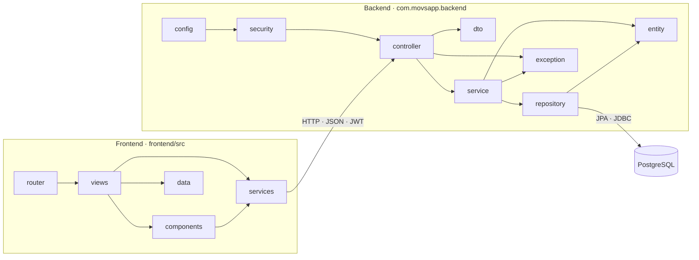
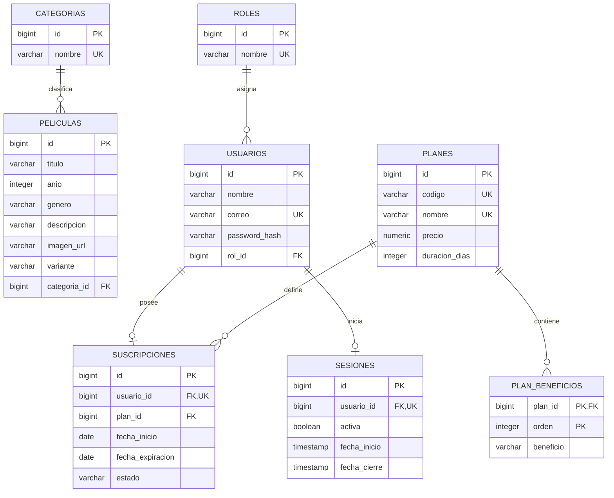
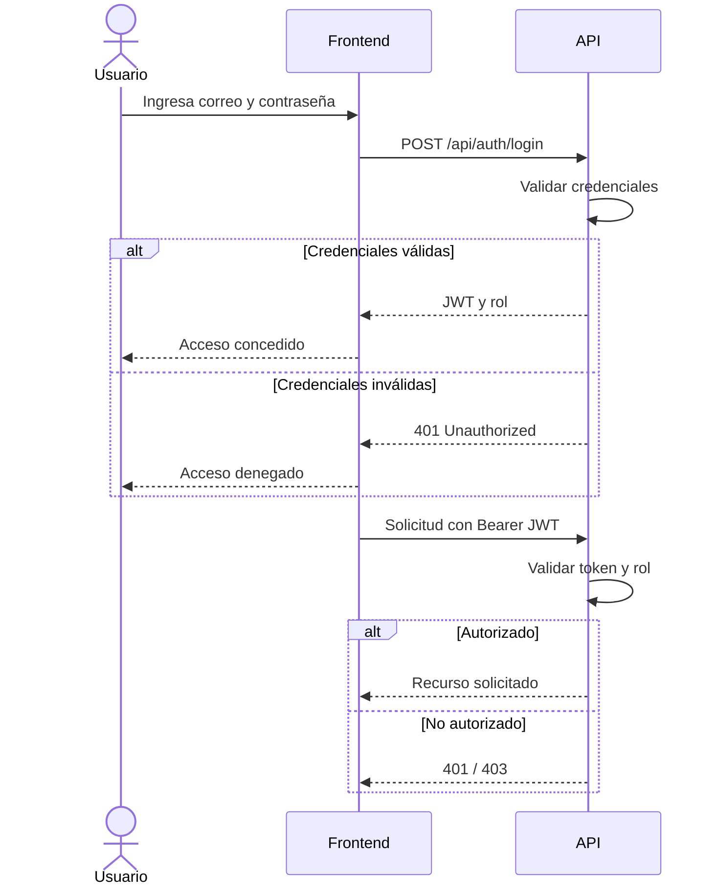

# Movs App

## Tabla de contenido

1. [Resumen](#1-resumen)
2. [Tecnologías usadas](#2-tecnologías-usadas)
3. [Instalación](#3-instalación)
4. [Opciones por rol](#4-opciones-por-rol)
5. [APIs disponibles](#5-apis-disponibles)
6. [Arquitectura](#6-arquitectura)

## 1. Resumen

Movs App es una aplicación académica para administrar usuarios, planes, suscripciones, sesiones y un catálogo de 1.000 películas. Incluye un frontend en Vue, una API REST en Spring Boot, persistencia en PostgreSQL, autenticación JWT y roles `ADMIN` y `USER`.

## 2. Tecnologías usadas

| Tecnología | Versión exacta | Uso |
|---|---:|---|
| Java | 17.0.12 | Ejecución del backend |
| Apache Maven | 3.9.9 | Compilación y empaquetado WAR |
| Spring Boot | 3.5.15 | API REST y configuración principal |
| Springdoc OpenAPI | 2.8.14 | Swagger UI y contrato OpenAPI |
| PostgreSQL | 17.10 | Base de datos relacional |
| Node.js | 24.13.0 | Ejecución del frontend |
| Vue | 3.5.34 | Interfaz web |
| Vue Router | 5.0.7 | Navegación del frontend |
| Vite | 8.0.13 | Servidor y compilación del frontend |
| Tailwind CSS | 4.3.0 | Estilos de la interfaz |
| Bootstrap | 5.3.8 | Componentes y utilidades visuales |
| Lucide Vue | 1.16.0 | Iconos |

## 3. Instalación

1. Clonar el repositorio y entrar al proyecto:

   ```bash
   git clone git@github.com:brigitterodriguezp/movs-app.git
   cd movs-app
   ```

2. Asegurarse de que PostgreSQL esté corriendo (servicio de Windows `postgresql-x64-17`).

3. Crear la base de datos y el usuario técnico:

   Contenido de `db/00_create_database_and_user.sql`:

   ```sql
   -- Ejecutar con psql como el usuario administrador postgres.
   DO $$
   BEGIN
     IF NOT EXISTS (SELECT 1 FROM pg_roles WHERE rolname = 'brigitte') THEN
       CREATE ROLE brigitte LOGIN PASSWORD 'brigitte.2005' NOSUPERUSER NOCREATEDB NOCREATEROLE NOINHERIT;
     ELSE
       ALTER ROLE brigitte WITH LOGIN PASSWORD 'brigitte.2005' NOSUPERUSER NOCREATEDB NOCREATEROLE NOINHERIT;
     END IF;
   END
   $$;

   SELECT 'CREATE DATABASE movs_app_db OWNER postgres ENCODING ''UTF8'''
   WHERE NOT EXISTS (SELECT 1 FROM pg_database WHERE datname = 'movs_app_db')\gexec

   REVOKE ALL ON DATABASE movs_app_db FROM PUBLIC;
   GRANT CONNECT ON DATABASE movs_app_db TO brigitte;
   ```

   ```bash
   psql -U postgres -v ON_ERROR_STOP=1 -f db/00_create_database_and_user.sql
   ```

4. Crear el esquema:

   Contenido de `db/01_schema.sql`:

   ```sql
   \connect movs_app_db

   REVOKE CREATE ON SCHEMA public FROM PUBLIC;
   GRANT USAGE ON SCHEMA public TO brigitte;

   CREATE TABLE IF NOT EXISTS roles (
     id BIGINT GENERATED BY DEFAULT AS IDENTITY,
     nombre VARCHAR(30) NOT NULL,
     CONSTRAINT pk_roles PRIMARY KEY (id),
     CONSTRAINT uk_roles_nombre UNIQUE (nombre)
   );

   CREATE TABLE IF NOT EXISTS usuarios (
     id BIGINT GENERATED BY DEFAULT AS IDENTITY,
     nombre VARCHAR(120) NOT NULL,
     correo VARCHAR(160) NOT NULL,
     password_hash VARCHAR(100) NOT NULL,
     rol_id BIGINT NOT NULL,
     CONSTRAINT pk_usuarios PRIMARY KEY (id),
     CONSTRAINT uk_usuarios_correo UNIQUE (correo),
     CONSTRAINT fk_usuarios_roles FOREIGN KEY (rol_id) REFERENCES roles(id)
   );
   CREATE INDEX IF NOT EXISTS idx_usuarios_rol ON usuarios (rol_id);

   CREATE TABLE IF NOT EXISTS planes (
     id BIGINT GENERATED BY DEFAULT AS IDENTITY,
     codigo VARCHAR(30) NOT NULL,
     nombre VARCHAR(80) NOT NULL,
     precio NUMERIC(10,2) NOT NULL,
     duracion_dias INTEGER NOT NULL,
     CONSTRAINT pk_planes PRIMARY KEY (id),
     CONSTRAINT uk_planes_codigo UNIQUE (codigo),
     CONSTRAINT uk_planes_nombre UNIQUE (nombre),
     CONSTRAINT chk_planes_precio CHECK (precio >= 0),
     CONSTRAINT chk_planes_duracion CHECK (duracion_dias > 0)
   );

   CREATE TABLE IF NOT EXISTS plan_beneficios (
     plan_id BIGINT NOT NULL,
     orden INTEGER NOT NULL,
     beneficio VARCHAR(180) NOT NULL,
     CONSTRAINT pk_plan_beneficios PRIMARY KEY (plan_id, orden),
     CONSTRAINT fk_beneficios_planes FOREIGN KEY (plan_id) REFERENCES planes(id) ON DELETE CASCADE
   );

   CREATE TABLE IF NOT EXISTS suscripciones (
     id BIGINT GENERATED BY DEFAULT AS IDENTITY,
     usuario_id BIGINT NOT NULL,
     plan_id BIGINT NOT NULL,
     fecha_inicio DATE NOT NULL,
     fecha_expiracion DATE NOT NULL,
     estado VARCHAR(20) NOT NULL,
     CONSTRAINT pk_suscripciones PRIMARY KEY (id),
     CONSTRAINT uk_suscripciones_usuario UNIQUE (usuario_id),
     CONSTRAINT fk_suscripciones_usuarios FOREIGN KEY (usuario_id) REFERENCES usuarios(id),
     CONSTRAINT fk_suscripciones_planes FOREIGN KEY (plan_id) REFERENCES planes(id),
     CONSTRAINT chk_suscripciones_fechas CHECK (fecha_expiracion > fecha_inicio),
     CONSTRAINT chk_suscripciones_estado CHECK (estado IN ('ACTIVA','VENCIDA','CANCELADA'))
   );
   CREATE INDEX IF NOT EXISTS idx_suscripciones_plan ON suscripciones (plan_id);

   CREATE TABLE IF NOT EXISTS categorias (
     id BIGINT GENERATED BY DEFAULT AS IDENTITY,
     nombre VARCHAR(80) NOT NULL,
     CONSTRAINT pk_categorias PRIMARY KEY (id),
     CONSTRAINT uk_categorias_nombre UNIQUE (nombre)
   );
   CREATE INDEX IF NOT EXISTS idx_categorias_nombre ON categorias (nombre);

   CREATE TABLE IF NOT EXISTS peliculas (
     id BIGINT GENERATED BY DEFAULT AS IDENTITY,
     titulo VARCHAR(160) NOT NULL,
     anio INTEGER NOT NULL,
     genero VARCHAR(60) NOT NULL,
     descripcion VARCHAR(1000) NOT NULL,
     imagen_url VARCHAR(255) NOT NULL,
     variante VARCHAR(60),
     categoria_id BIGINT NOT NULL,
     CONSTRAINT pk_peliculas PRIMARY KEY (id),
     CONSTRAINT chk_peliculas_anio CHECK (anio BETWEEN 1888 AND 2100),
     CONSTRAINT fk_peliculas_categorias FOREIGN KEY (categoria_id) REFERENCES categorias(id)
   );
   CREATE INDEX IF NOT EXISTS idx_peliculas_titulo ON peliculas (titulo);
   CREATE INDEX IF NOT EXISTS idx_peliculas_genero ON peliculas (genero);
   CREATE INDEX IF NOT EXISTS idx_peliculas_categoria ON peliculas (categoria_id);

   CREATE TABLE IF NOT EXISTS sesiones (
     id BIGINT GENERATED BY DEFAULT AS IDENTITY,
     usuario_id BIGINT NOT NULL,
     activa BOOLEAN NOT NULL DEFAULT FALSE,
     fecha_inicio TIMESTAMP(6) NOT NULL,
     fecha_cierre TIMESTAMP(6),
     CONSTRAINT pk_sesiones PRIMARY KEY (id),
     CONSTRAINT uk_sesiones_usuario UNIQUE (usuario_id),
     CONSTRAINT fk_sesiones_usuarios FOREIGN KEY (usuario_id) REFERENCES usuarios(id) ON DELETE CASCADE
   );
   CREATE INDEX IF NOT EXISTS idx_sesiones_activa ON sesiones (activa);

   GRANT SELECT, INSERT, UPDATE, DELETE ON ALL TABLES IN SCHEMA public TO brigitte;
   GRANT USAGE, SELECT ON ALL SEQUENCES IN SCHEMA public TO brigitte;
   ALTER DEFAULT PRIVILEGES IN SCHEMA public GRANT SELECT, INSERT, UPDATE, DELETE ON TABLES TO brigitte;
   ALTER DEFAULT PRIVILEGES IN SCHEMA public GRANT USAGE, SELECT ON SEQUENCES TO brigitte;
   ```

   ```bash
   psql -U postgres -v ON_ERROR_STOP=1 -d movs_app_db -f db/01_schema.sql
   ```

5. Cargar los datos de prueba:

   Contenido de `db/02_seed.sql`:

   ```sql
   \connect movs_app_db

   INSERT INTO roles (id, nombre) VALUES (1, 'ADMIN'), (2, 'USER')
   ON CONFLICT (id) DO UPDATE SET nombre = EXCLUDED.nombre;

   INSERT INTO planes (id, codigo, nombre, precio, duracion_dias) VALUES
     (1, 'basic', 'Basic', 4.99, 30),
     (2, 'plus', 'Plus', 8.99, 30)
   ON CONFLICT (id) DO UPDATE SET codigo = EXCLUDED.codigo, nombre = EXCLUDED.nombre,
     precio = EXCLUDED.precio, duracion_dias = EXCLUDED.duracion_dias;

   INSERT INTO plan_beneficios (plan_id, orden, beneficio) VALUES
     (1,0,'1 pantalla'),(1,1,'Catálogo esencial'),(1,2,'Calidad HD'),
     (2,0,'3 pantallas'),(2,1,'Estrenos destacados'),(2,2,'Full HD y favoritos')
   ON CONFLICT (plan_id, orden) DO UPDATE SET beneficio = EXCLUDED.beneficio;

   INSERT INTO categorias (id, nombre) VALUES
     (1,'Drama'),(2,'Suspenso'),(3,'Terror'),(4,'Crimen'),
     (5,'Misterio'),(6,'Biografía'),(7,'Romance'),(8,'Comedia'),
     (9,'Acción'),(10,'Ciencia ficción'),(11,'Documental')
   ON CONFLICT (id) DO UPDATE SET nombre = EXCLUDED.nombre;

   INSERT INTO peliculas (id,titulo,anio,genero,descripcion,imagen_url,variante,categoria_id) VALUES
    (1,'Cover Story',2026,'Drama','Una historia íntima para volver cuando la noche pide calma.','001-cover.png','movie-card-featured',1),
    (2,'La Niñera',2025,'Suspenso','Una casa tranquila empieza a guardar demasiados secretos.','002-ninera.png','movie-card-tall',2),
    (3,'Scary Movie',2024,'Terror','Risas oscuras, sustos rápidos y una noche imposible de pausar.','003-scary-movie.png',NULL,3),
    (4,'Little Women',2023,'Drama','Decisiones grandes en habitaciones pequeñas.','004-little-women.png',NULL,1),
    (5,'Joker',2022,'Crimen','Una mirada intensa a una ciudad que ya no sabe escuchar.','005-joker.png','movie-card-wide',4),
    (6,'The Frightening',2021,'Misterio','Algo se mueve entre pasillos donde nadie debería estar.','006-the-frightening.png',NULL,5),
    (7,'Marilyn Monroe',2020,'Biografía','Luz, cámara y una silueta que nunca dejó de aparecer.','007-marilyn-monroe.png',NULL,6),
    (8,'Love Untangled',2025,'Romance','Primer amor, nervios y una confesión esperando su momento.','009-love-untangled.png','movie-card-wide',7)
   ON CONFLICT (id) DO UPDATE SET titulo=EXCLUDED.titulo, anio=EXCLUDED.anio, genero=EXCLUDED.genero,
    descripcion=EXCLUDED.descripcion, imagen_url=EXCLUDED.imagen_url, variante=EXCLUDED.variante, categoria_id=EXCLUDED.categoria_id;

   INSERT INTO peliculas (id, titulo, anio, genero, descripcion, imagen_url, variante, categoria_id)
   SELECT n,
          'Película de catálogo ' || lpad(n::text, 4, '0'),
          1980 + (n % 46)::integer,
          (ARRAY['Drama','Comedia','Acción','Ciencia ficción','Documental'])[1 + (n % 5)::integer],
          'Película generada para validar el catálogo académico de Movs App.',
          'catalogo-' || lpad(n::text, 4, '0') || '.png',
          NULL,
          (ARRAY[1,8,9,10,11])[1 + (n % 5)::integer]
   FROM generate_series(9, 1000) AS n
   ON CONFLICT (id) DO NOTHING;

   SELECT setval(pg_get_serial_sequence('roles','id'), (SELECT MAX(id) FROM roles), true);
   SELECT setval(pg_get_serial_sequence('planes','id'), (SELECT MAX(id) FROM planes), true);
   SELECT setval(pg_get_serial_sequence('categorias','id'), (SELECT MAX(id) FROM categorias), true);
   SELECT setval(pg_get_serial_sequence('peliculas','id'), (SELECT MAX(id) FROM peliculas), true);
   ```

   ```bash
   psql -U postgres -v ON_ERROR_STOP=1 -d movs_app_db -f db/02_seed.sql
   ```

6. Verificar los conteos:

   Contenido de `db/03_verify.sql`:

   ```sql
   \connect movs_app_db

   SELECT COUNT(*) FROM peliculas;
   SELECT COUNT(*) FROM usuarios;
   SELECT COUNT(*) FROM suscripciones;
   SELECT COUNT(*) FROM sesiones;
   ```

   ```bash
   psql -U postgres -v ON_ERROR_STOP=1 -d movs_app_db -f db/03_verify.sql
   ```

7. Crear el archivo local de variables de entorno:

   ```bash
   cp .env.example .env
   ```

   Reemplazar los valores `CHANGE_ME` dentro de `.env`.

8. Exportar las variables e iniciar el backend:

   ```bash
   set -a
   source .env
   set +a
   mvn spring-boot:run
   ```

9. En otra terminal, instalar e iniciar el frontend:

   ```bash
   cd frontend
   npm install
   npm run dev
   ```

10. Abrir la aplicación y Swagger:

    ```text
    Frontend: http://localhost:5173/movs-app/
    Swagger:  http://localhost:8080/swagger-ui.html
    ```

## 4. Opciones por rol

| Opción | Público | USER | ADMIN |
|---|:---:|:---:|:---:|
| Consultar planes y películas | Sí | Sí | Sí |
| Registrar una cuenta con rol `USER` | Sí | — | — |
| Iniciar sesión | Sí | — | — |
| Cerrar sesión | No | Sí | Sí |
| Consultar perfil propio | No | Sí | Sí |
| Consultar suscripción propia | No | Sí | Sí |
| Administrar usuarios | No | No | Sí |
| Administrar suscripciones | No | No | Sí |
| Crear, editar y eliminar planes | No | No | Sí |
| Crear, editar y eliminar películas | No | No | Sí |
| Acceder al Panel de administración | No | No | Sí |

## 5. APIs disponibles

### 5.1. Autenticación y registro

| Método | Endpoint | Acceso | Descripción |
|---|---|---|---|
| `POST` | `/api/auth/login` | Público | Iniciar sesión y obtener JWT |
| `POST` | `/api/auth/logout` | USER / ADMIN | Cerrar la sesión activa |
| `GET` | `/api/auth/sesion/{idUsuario}` | Propio / ADMIN | Consultar una sesión |
| `POST` | `/api/registro` | Público | Registrar un usuario `USER` con suscripción |

### 5.2. Usuarios

| Método | Endpoint | Acceso | Descripción |
|---|---|---|---|
| `GET` | `/api/usuarios/me` | USER / ADMIN | Consultar el perfil autenticado |
| `GET` | `/api/usuarios` | ADMIN | Listar usuarios |
| `GET` | `/api/usuarios/{id}` | ADMIN | Consultar un usuario |
| `GET` | `/api/usuarios/rol/{rol}` | ADMIN | Filtrar usuarios por rol |
| `POST` | `/api/usuarios` | ADMIN | Crear un usuario |
| `PUT` | `/api/usuarios/{id}` | ADMIN | Actualizar un usuario |
| `DELETE` | `/api/usuarios/{id}` | ADMIN | Eliminar un usuario |

### 5.3. Planes

| Método | Endpoint | Acceso | Descripción |
|---|---|---|---|
| `GET` | `/api/planes` | Público | Listar planes |
| `GET` | `/api/planes/{id}` | Público | Consultar un plan |
| `POST` | `/api/planes` | ADMIN | Crear un plan |
| `PUT` | `/api/planes/{id}` | ADMIN | Actualizar un plan |
| `DELETE` | `/api/planes/{id}` | ADMIN | Eliminar un plan |

### 5.4. Suscripciones

| Método | Endpoint | Acceso | Descripción |
|---|---|---|---|
| `GET` | `/api/suscripciones` | ADMIN | Listar suscripciones |
| `GET` | `/api/suscripciones/{id}` | ADMIN | Consultar una suscripción |
| `GET` | `/api/suscripciones/usuario/{idUsuario}` | Propio / ADMIN | Consultar una suscripción por usuario |
| `POST` | `/api/suscripciones` | Propio / ADMIN | Crear una suscripción |
| `PUT` | `/api/suscripciones/{id}` | ADMIN | Actualizar una suscripción |
| `DELETE` | `/api/suscripciones/{id}` | ADMIN | Eliminar una suscripción |

### 5.5. Películas

| Método | Endpoint | Acceso | Descripción |
|---|---|---|---|
| `GET` | `/api/peliculas` | Público | Listar películas |
| `GET` | `/api/peliculas/{id}` | Público | Consultar una película |
| `GET` | `/api/peliculas/genero/{genero}` | Público | Filtrar películas por género |
| `GET` | `/api/peliculas/buscar?titulo={titulo}` | Público | Buscar películas por título |
| `POST` | `/api/peliculas` | ADMIN | Crear una película |
| `PUT` | `/api/peliculas/{id}` | ADMIN | Actualizar una película |
| `DELETE` | `/api/peliculas/{id}` | ADMIN | Eliminar una película |

### 5.6. Documentación

| Método | Endpoint | Acceso | Descripción |
|---|---|---|---|
| `GET` | `/v3/api-docs` | Público | Consultar OpenAPI en JSON |
| `GET` | `/swagger-ui.html` | Público | Abrir Swagger UI |

## 6. Arquitectura

### 6.1. Diagrama de paquetes



### 6.2. Diagrama entidad-relación



### 6.3. Diagrama de secuencia de autenticación

El flujo muestra la autenticación, emisión del JWT y autorización de una solicitud protegida.


