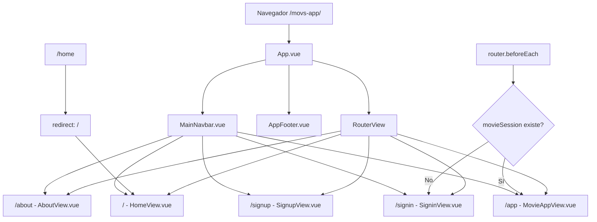
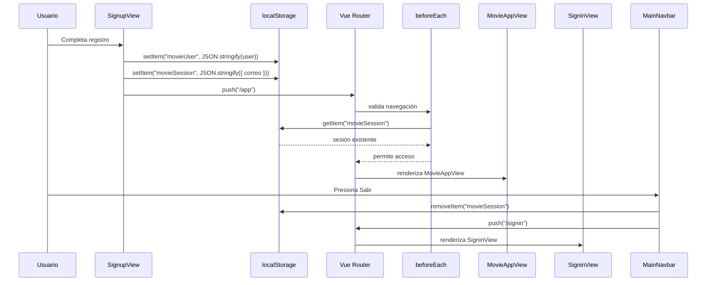

# Movs App

Movs App es una aplicación web de películas desarrollada con Vue 3, Vite, Vue Router, Tailwind CSS, Bootstrap y Lucide. Yo la construí como una experiencia visual para navegar una pequeña colección de películas, registrar una cuenta local, iniciar sesión y proteger el acceso a la vista principal de la app.

La aplicación no usa backend ni base de datos externa. Su autenticación es local y se apoya en la Web Storage API del navegador, específicamente `localStorage`.

## Tabla de Contenido

1. [Descripción técnica](#descripción-técnica)
2. [Dependencias exactas](#dependencias-exactas)
3. [Estructura principal](#estructura-principal)
4. [Mapa de rutas](#mapa-de-rutas)
5. [Autenticación y localStorage](#autenticación-y-localstorage)
6. [Comunicación entre vistas](#comunicación-entre-vistas)
7. [Ejecución local](#ejecución-local)
8. [Build y deploy](#build-y-deploy)

## Descripción Técnica

Movs App es una Single Page Application. Vue renderiza la interfaz, Vue Router controla la navegación interna y Vite sirve el proyecto en desarrollo y genera el build de producción.

La app tiene estas partes principales:

- `HomeView.vue`: pantalla inicial con portada visual y enlaces hacia la app o registro.
- `AboutView.vue`: sección informativa con carrusel de películas.
- `SignupView.vue`: formulario de registro local.
- `SigninView.vue`: formulario de inicio de sesión local.
- `MovieAppView.vue`: vista protegida con el grid de películas.
- `MainNavbar.vue`: navegación global, adaptada para desktop y móvil.
- `AppFooter.vue`: pie de página global.

## Dependencias Exactas

Dependencias de producción, según `package.json`:

| Librería | Versión | Uso |
| --- | --- | --- |
| `vue` | `^3.5.32` | Framework principal para componentes reactivos. |
| `vue-router` | `^5.0.4` | Enrutamiento SPA y guard para proteger `/app`. |
| `vite` | `^8.0.8` | Servidor de desarrollo y empaquetador. |
| `@vitejs/plugin-vue` | `^6.0.6` | Soporte de archivos `.vue` en Vite. |
| `@vitejs/plugin-vue-jsx` | `^5.1.5` | Soporte opcional de JSX para Vue. |
| `tailwindcss` | `^4.3.0` | Utilidades CSS para layout, responsive y estilos rápidos. |
| `@tailwindcss/vite` | `^4.3.0` | Integración de Tailwind con Vite. |
| `bootstrap` | `^5.3.8` | Estilos base y JavaScript del carrusel. |
| `@lucide/vue` | `^1.16.0` | Iconos usados en navbar, formularios y tarjetas. |
| `gh-pages` | `^6.3.0` | Publicación del build en GitHub Pages. |
| `vite-plugin-vue-devtools` | `^8.1.1` | Herramientas de desarrollo para Vue. |

Versión de Node requerida:

```txt
^20.19.0 || >=22.12.0
```

## Estructura Principal

```txt
src/
  assets/
    main.css
    base.css
    movies/
  components/
    AppFooter.vue
    MainNavbar.vue
    MovieCard.vue
  router/
    index.js
  views/
    AboutView.vue
    HomeView.vue
    MovieAppView.vue
    SigninView.vue
    SignupView.vue
  App.vue
  main.js
```

El archivo `src/main.js` importa Bootstrap CSS, Bootstrap JS y los estilos del proyecto. Después crea la app con `createApp(App)`, instala el router con `app.use(router)` y monta la aplicación en `#app`.

## Mapa de Rutas

Las rutas están definidas en `src/router/index.js` con `createRouter` y `createWebHistory(import.meta.env.BASE_URL)`. El `base` configurado en `vite.config.js` es:

```js
base: '/movs-app/'
```

Por eso, en desarrollo y producción la app trabaja bajo `/movs-app/`.



Tabla de rutas:

| Ruta | Nombre | Componente | Acceso |
| --- | --- | --- | --- |
| `/` | `home` | `HomeView.vue` | Público |
| `/home` | No aplica | Redirige a `/` | Público |
| `/about` | `about` | `AboutView.vue` | Público |
| `/signin` | `signin` | `SigninView.vue` | Público |
| `/signup` | `signup` | `SignupView.vue` | Público |
| `/app` | `movie-app` | `MovieAppView.vue` | Protegido por `movieSession` |

## Autenticación y localStorage

La autenticación está hecha en el frontend. No se llama a una API HTTP, no hay `fetch`, no hay `axios` y no existe una base de datos remota. La API web que se usa es la Web Storage API del navegador mediante `localStorage`.

### Registro

El registro ocurre en `src/views/SignupView.vue`.

Campos del formulario:

- `nombres`
- `apellidos`
- `correo`
- `clave`

Validación actual:

- Todos los campos deben tener valor.
- El correo se normaliza con `trim().toLowerCase()`.
- La clave se guarda como texto plano porque el proyecto no usa backend ni hashing.

Cuando el usuario se registra, la app crea dos entradas en `localStorage`:

```js
localStorage.setItem('movieUser', JSON.stringify(user))
localStorage.setItem('movieSession', JSON.stringify({ correo: user.correo }))
```

Estructura de `movieUser`:

```json
{
  "nombres": "Brigitte",
  "apellidos": "Rodriguez",
  "correo": "correo@ejemplo.com",
  "clave": "123456"
}
```

Estructura de `movieSession`:

```json
{
  "correo": "correo@ejemplo.com"
}
```

Después del registro, `SignupView.vue` ejecuta:

```js
router.push('/app')
```

Esto manda a la persona directamente a la vista protegida.

### Inicio de Sesión

El inicio de sesión ocurre en `src/views/SigninView.vue`.

Flujo técnico:

1. Se lee el usuario guardado:

```js
const user = JSON.parse(localStorage.getItem('movieUser') || 'null')
```

2. Se normaliza el correo ingresado:

```js
const correo = form.correo.trim().toLowerCase()
```

3. Si no existe `movieUser`, se muestra el error:

```txt
Primero crea una cuenta.
```

4. Si el correo o clave no coinciden, se muestra:

```txt
Correo o clave incorrectos.
```

5. Si los datos son válidos, se crea la sesión:

```js
localStorage.setItem('movieSession', JSON.stringify({ correo }))
router.push('/app')
```

### Cierre de Sesión

El cierre de sesión está en `src/components/MainNavbar.vue`.

Cuando existe `movieSession`, el navbar muestra el botón `Salir`. Al presionarlo:

```js
localStorage.removeItem('movieSession')
router.push('/signin')
```

Esto elimina solo la sesión activa. El usuario registrado (`movieUser`) se conserva en el navegador.

### Protección de `/app`

La ruta `/app` se protege con un guard global:

```js
router.beforeEach((to) => {
  const session = localStorage.getItem('movieSession')

  if (to.path === '/app' && !session) {
    return '/signin'
  }
})
```

Si una persona intenta entrar a `/app` sin sesión, Vue Router la redirige a `/signin`.

### Consideración de Seguridad

Este sistema sirve para una práctica frontend y para simular autenticación local. No debe usarse como autenticación real en producción porque:

- La clave queda guardada en texto plano.
- Cualquier persona con acceso al navegador puede ver o modificar `localStorage`.
- No hay tokens firmados, expiración de sesión ni validación en servidor.
- No hay protección real contra manipulación del estado del cliente.

## Comunicación Entre Vistas

Las vistas no se comunican por props directas. La comunicación se hace por dos mecanismos:

- `vue-router`: cambia la vista activa dentro de `RouterView`.
- `localStorage`: conserva `movieUser` y `movieSession` entre vistas y recargas.



## Ejecución Local

Instalar dependencias:

```sh
npm install
```

Levantar el servidor de desarrollo:

```sh
npm run dev
```

En este proyecto, Vite muestra una URL parecida a:

```txt
http://localhost:5173/movs-app/
```

Si se desea exponer en red local:

```sh
npm run dev -- --host 0.0.0.0
```

Compilar producción:

```sh
npm run build
```

Previsualizar el build:

```sh
npm run preview
```

## Build y Deploy

El deploy está definido en `package.json`:

```json
{
  "deploy": "npm run build && gh-pages -d dist"
}
```

Ejecutar deploy:

```sh
npm run deploy
```

Ese comando:

1. Ejecuta `vite build`.
2. Genera la carpeta `dist`.
3. Publica `dist` en GitHub Pages usando `gh-pages`.

Como `vite.config.js` define `base: '/movs-app/'`, los assets se construyen con rutas correctas para GitHub Pages.
