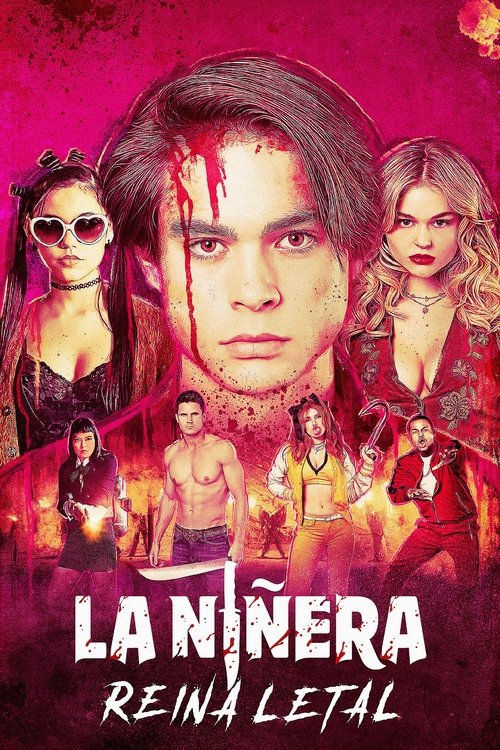

# Movs App

## 1. Nombre del proyecto

Movs App

## 2. Descripción de la idea

Movs App es una aplicación web tipo SPA para presentar una selección visual de películas. El sistema permite navegar por una página principal, crear una cuenta, iniciar sesión y entrar a una vista protegida donde se muestran tarjetas de películas con título, año, género, descripción e imagen.

## 3. Problema que resuelve

El proyecto resuelve la necesidad de tener un espacio simple y visual para organizar y consultar una colección de películas. Además, permite practicar un flujo básico de autenticación usando almacenamiento local del navegador, sin depender de una base de datos o backend externo.

## 4. Público objetivo

La aplicación está dirigida a usuarios que disfrutan ver películas y quieren explorar una colección organizada. También está pensada como proyecto académico para demostrar manejo de componentes, rutas, formularios, validaciones, estilos responsive y almacenamiento local.

## 5. Framework seleccionado al inicio de la actividad

Vue.js, utilizando Vite como herramienta de desarrollo y construcción del proyecto.

## 6. Tecnologías utilizadas

1. Vue 3: framework principal para construir la interfaz por componentes.
2. Vite: servidor de desarrollo y herramienta para generar la versión de producción.
3. Vue Router: manejo de rutas públicas y ruta protegida.
4. Tailwind CSS: estilos utilitarios y diseño responsive.
5. Bootstrap: estilos y componentes base.
6. Lucide Vue: iconos usados en botones, formularios y navegación.
7. LocalStorage: almacenamiento del usuario registrado y la sesión activa en el navegador.
8. JSON: archivo local que simula una API para cargar las películas.
9. JavaScript: lógica de formularios, validaciones, navegación y mapeo de datos.
10. HTML y CSS: estructura visual y estilos globales.

## 7. Pasos de instalación o ejecución

1. Clonar o descargar el proyecto.

2. Entrar a la carpeta del proyecto:

```bash
cd P1ExamenRodriguezBrigitte
```

3. Instalar las dependencias:

```bash
npm install
```

4. Ejecutar el servidor de desarrollo:

```bash
npm run dev
```

5. Abrir la URL que muestra Vite en el navegador. Normalmente será:

```txt
http://localhost:5173/movs-app/
```

6. Para generar la versión de producción:

```bash
npm run build
```

## 8. Estructura básica del proyecto

```txt
P1ExamenRodriguezBrigitte/
  public/
    favicon.ico
  src/
    assets/
      base.css
      main.css
      movies/
        001-cover.png
        002-ninera.png
        003-scary-movie.png
        004-little-women.png
        005-joker.png
        006-the-frightening.png
        007-marilyn-monroe.png
        009-love-untangled.png
        main-cover.png
    components/
      skeletons/
        AboutSkeleton.vue
        HomeSkeleton.vue
        MovieGridSkeleton.vue
        SigninSkeleton.vue
        SignupSkeleton.vue
      AppFooter.vue
      MainNavbar.vue
      MovieCard.vue
    data/
      movies.json
    router/
      index.js
    views/
      AboutView.vue
      HomeView.vue
      MovieAppView.vue
      SigninView.vue
      SignupView.vue
    App.vue
    main.js
  index.html
  package.json
  vite.config.js
  README.md
```

1. `src/main.js`: inicializa la aplicación Vue.
2. `src/App.vue`: contiene la estructura principal con navegación, rutas y pie de página.
3. `src/router/index.js`: define las rutas y protege la ruta `/app`.
4. `src/views/HomeView.vue`: pantalla principal de bienvenida.
5. `src/views/SignupView.vue`: formulario de registro con plan y datos de pago.
6. `src/views/SigninView.vue`: formulario de inicio de sesión.
7. `src/views/MovieAppView.vue`: catálogo visual de películas que mapea los datos desde `movies.json`.
8. `src/components/`: componentes reutilizables como navbar, footer, tarjetas y loaders skeleton.
9. `src/assets/movies/`: imágenes utilizadas por el sistema.
10. `src/data/movies.json`: archivo JSON que simula una API de películas.

## 9. Capturas de pantalla del sistema

1. Pantalla principal:


2. Catálogo de películas:


3. Tarjetas de películas:



4. Ejemplo de película destacada:


## 10. Integrantes y asignatura

1. Integrante: Brigitte Rodríguez.
2. Asignatura: Programación Web.
3. Actividad: P1 Examen.
