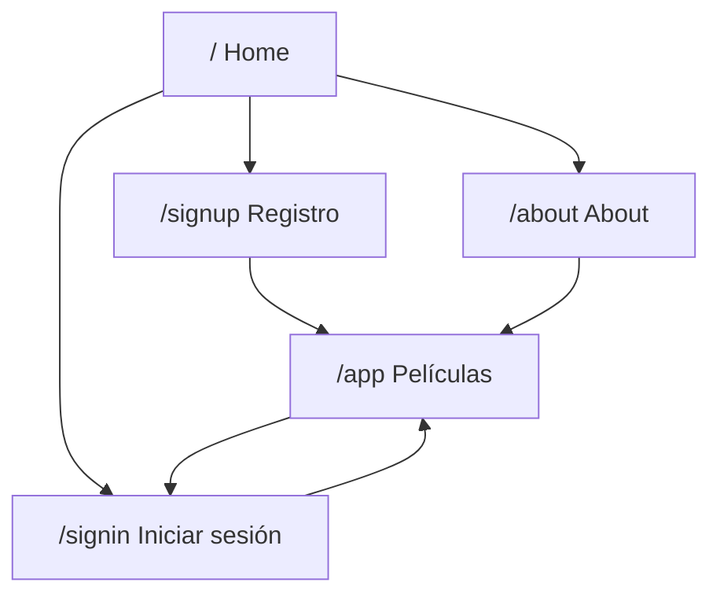
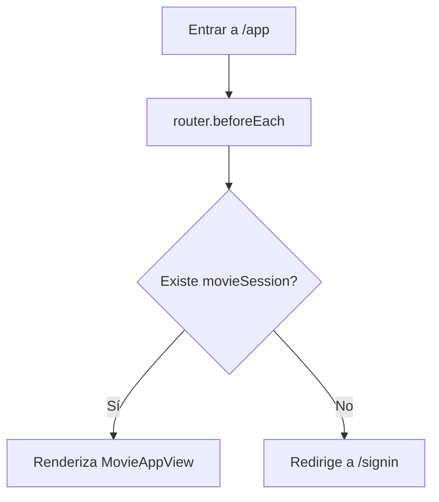
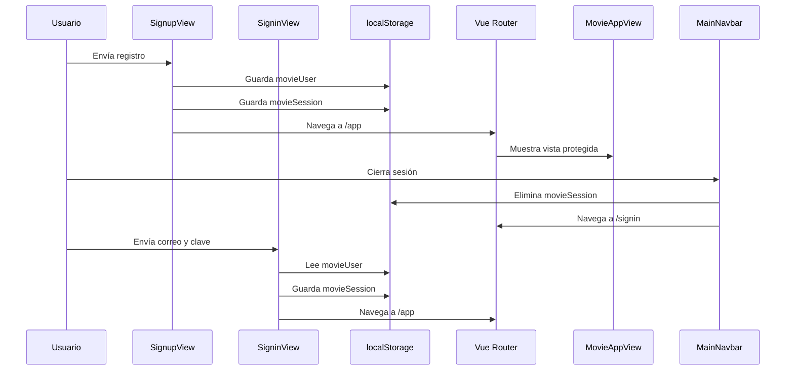

# Movs App

## 1. Descripción

Aplicación web de películas desarrollada como una SPA con Vue. Permite navegar entre páginas principales, registrar un usuario, iniciar sesión, cerrar sesión y acceder a una vista protegida con tarjetas de películas.

El proyecto usa autenticación local. No consume una API externa ni utiliza base de datos; los datos se guardan en el navegador mediante `localStorage`, que pertenece a la Web Storage API.

## 2. Objetivo

1. Presentar una interfaz responsive para una colección visual de películas.
2. Implementar navegación con rutas públicas y una ruta protegida.
3. Simular registro e inicio de sesión sin backend.
4. Persistir usuario y sesión en el navegador.
5. Publicar la aplicación en GitHub Pages.

## 3. Tecnologías Principales

| Librería | Versión | Uso |
| --- | --- | --- |
| `vue` | `^3.5.32` | Construcción de componentes y estado reactivo. |
| `vite` | `^8.0.8` | Servidor de desarrollo y build de producción. |
| `vue-router` | `^5.0.4` | Navegación SPA y protección de rutas. |
| `tailwindcss` | `^4.3.0` | Utilidades CSS para diseño responsive. |
| `@tailwindcss/vite` | `^4.3.0` | Integración de Tailwind con Vite. |
| `bootstrap` | `^5.3.8` | Componentes base y carrusel. |

Versión requerida de Node:

```txt
^20.19.0 || >=22.12.0
```

## 4. Estructura del Proyecto

```txt
src/
  assets/
    main.css
    base.css
    movies/
  components/
    AppFooter.vue
    MainNavbar.vue
    MovieCard.vue
  router/
    index.js
  views/
    AboutView.vue
    HomeView.vue
    MovieAppView.vue
    SigninView.vue
    SignupView.vue
  App.vue
  main.js
```

1. `main.js` inicializa Vue, registra Vue Router e importa estilos globales.
2. `App.vue` contiene el layout base: navbar, `RouterView` y footer.
3. `router/index.js` define las rutas y el guard de protección.
4. `views/` contiene las páginas principales.
5. `components/` contiene piezas reutilizables.
6. `assets/movies/` contiene las imágenes usadas en tarjetas y carrusel.

## 5. Mapa de Rutas

La aplicación usa `createWebHistory(import.meta.env.BASE_URL)`. En `vite.config.js` el `base` está configurado como:

```js
base: '/movs-app/'
```

Rutas principales:

| Ruta | Componente | Tipo |
| --- | --- | --- |
| `/` | `HomeView.vue` | Pública |
| `/about` | `AboutView.vue` | Pública |
| `/signin` | `SigninView.vue` | Pública |
| `/signup` | `SignupView.vue` | Pública |
| `/app` | `MovieAppView.vue` | Protegida |



## 6. Protección de Ruta

La ruta `/app` depende de la existencia de `movieSession` en `localStorage`.



Código principal:

```js
router.beforeEach((to) => {
  const session = localStorage.getItem('movieSession')

  if (to.path === '/app' && !session) {
    return '/signin'
  }
})
```

## 7. Registro

El registro se maneja en `SignupView.vue`.

1. El formulario recibe `nombres`, `apellidos`, `correo` y `clave`.
2. Se valida que ningún campo esté vacío.
3. El correo se normaliza con `trim().toLowerCase()`.
4. Se crea el objeto `user`.
5. Se guarda `movieUser` en `localStorage`.
6. Se crea `movieSession` para iniciar sesión automáticamente.
7. Se redirige a `/app`.

Objeto guardado como `movieUser`:

```json
{
  "nombres": "Brigitte",
  "apellidos": "Rodriguez",
  "correo": "correo@ejemplo.com",
  "clave": "123456"
}
```

Código usado para persistir el registro:

```js
localStorage.setItem('movieUser', JSON.stringify(user))
localStorage.setItem('movieSession', JSON.stringify({ correo: user.correo }))
router.push('/app')
```

## 8. Inicio de Sesión

El inicio de sesión se maneja en `SigninView.vue`.

1. Se lee `movieUser` desde `localStorage`.
2. Se normaliza el correo ingresado.
3. Se compara el correo y la clave contra el usuario guardado.
4. Si no existe usuario, se muestra `Primero crea una cuenta.`
5. Si las credenciales no coinciden, se muestra `Correo o clave incorrectos.`
6. Si las credenciales coinciden, se crea `movieSession`.
7. Se redirige a `/app`.

Lectura del usuario:

```js
const user = JSON.parse(localStorage.getItem('movieUser') || 'null')
```

Creación de sesión:

```js
localStorage.setItem('movieSession', JSON.stringify({ correo }))
router.push('/app')
```

Objeto guardado como `movieSession`:

```json
{
  "correo": "correo@ejemplo.com"
}
```

## 9. Cierre de Sesión

El cierre de sesión se ejecuta desde `MainNavbar.vue`.

1. Si existe `movieSession`, el navbar muestra la opción `Salir`.
2. Al salir, se elimina solo `movieSession`.
3. `movieUser` permanece guardado para futuros inicios de sesión.
4. Se redirige a `/signin`.

Código:

```js
localStorage.removeItem('movieSession')
router.push('/signin')
```

## 10. Web API Utilizada

La API web usada para autenticación local es `localStorage`.

1. `localStorage.setItem()` guarda datos como texto.
2. `JSON.stringify()` convierte objetos JavaScript en texto JSON.
3. `localStorage.getItem()` lee los datos guardados.
4. `JSON.parse()` convierte el texto JSON nuevamente en objeto.
5. `localStorage.removeItem()` elimina una clave específica.

Claves usadas:

| Clave | Contenido | Cuándo se crea | Cuándo se elimina |
| --- | --- | --- | --- |
| `movieUser` | Datos del usuario registrado | Registro | No se elimina desde la interfaz |
| `movieSession` | Correo de la sesión activa | Registro o inicio de sesión | Cierre de sesión |

## 11. Flujo de Autenticación



## 12. Ejecución

1. Instalar dependencias:

```sh
npm install
```

2. Levantar servidor local:

```sh
npm run dev
```

3. Abrir la ruta local:

```txt
http://localhost:5173/movs-app/
```

4. Compilar producción:

```sh
npm run build
```

5. Previsualizar build:

```sh
npm run preview
```

## 13. Deploy

El deploy se ejecuta con:

```sh
npm run deploy
```

Ese script realiza:

1. `npm run build`
2. Generación de `dist`
3. Publicación con `gh-pages -d dist`

El `base: '/movs-app/'` permite que los assets funcionen correctamente en GitHub Pages.

## 14. Nota de Seguridad

1. La autenticación es local y solo simula un flujo de usuario.
2. La clave queda guardada en texto plano.
3. `localStorage` puede inspeccionarse desde DevTools.
4. No debe usarse como autenticación real en producción.
