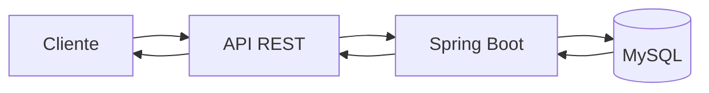
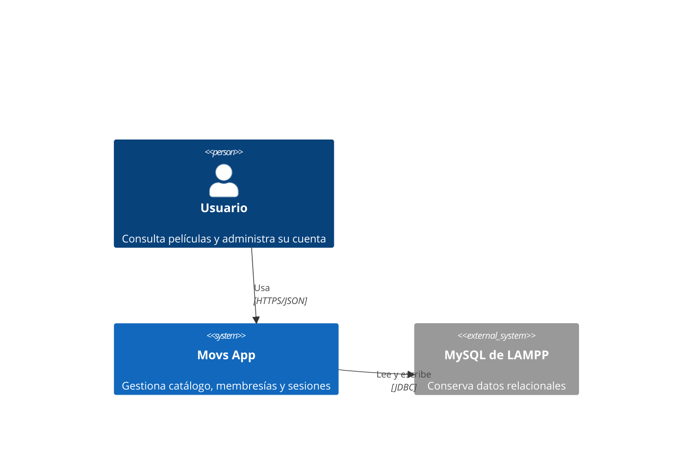
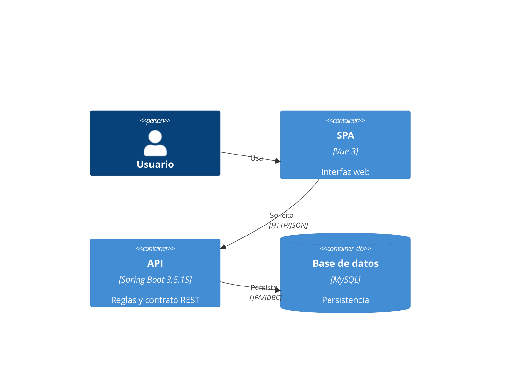
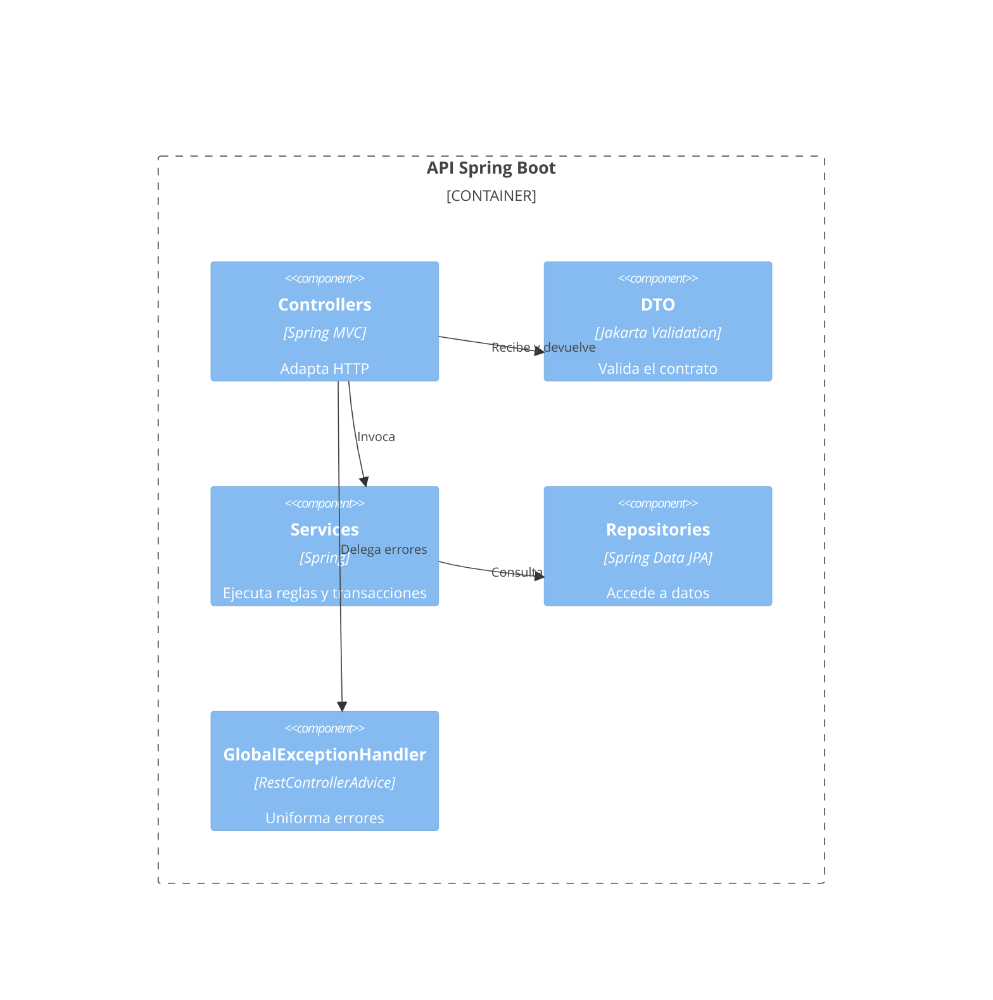
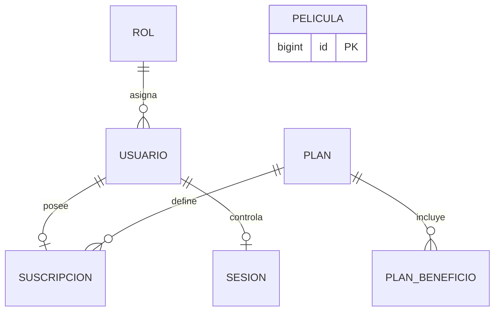
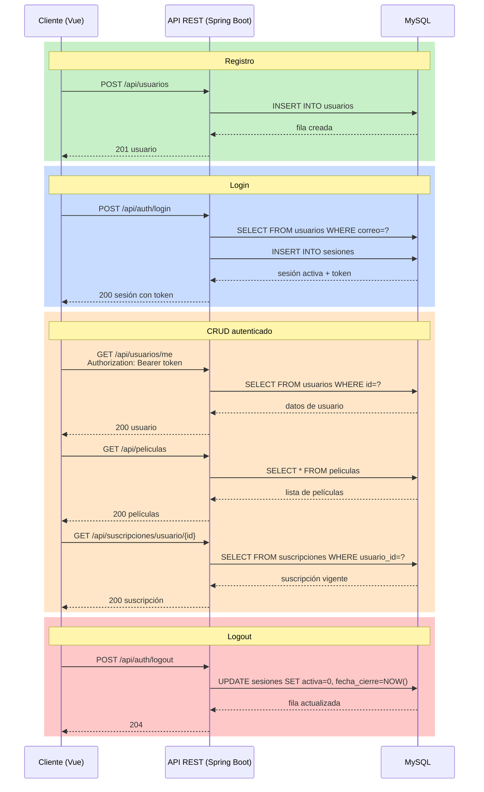

# Arquitectura

## Tabla de contenido

1. [Arquitectura por capas](#arquitectura-por-capas)
2. [Modelo C4 simplificado](#modelo-c4-simplificado)
   - [Nivel 1: Contexto](#nivel-1-contexto)
   - [Nivel 2: Contenedores](#nivel-2-contenedores)
   - [Nivel 3: Componentes](#nivel-3-componentes)
3. [Estructura de carpetas](#estructura-de-carpetas)
4. [Responsabilidad de capas](#responsabilidad-de-capas)
5. [Relaciones entre entidades](#relaciones-entre-entidades)
6. [Decisiones técnicas](#decisiones-técnicas)
7. [Control de sesión única](#control-de-sesión-única)

## Arquitectura por capas

El backend aplica dependencias unidireccionales. El controlador traduce HTTP, el servicio concentra reglas y transacciones, el repositorio abstrae JPA y la entidad representa persistencia. Los DTO delimitan el contrato externo. La configuración define componentes transversales y la capa de excepciones normaliza fallos.



## Modelo C4 simplificado

### Nivel 1: Contexto



### Nivel 2: Contenedores



### Nivel 3: Componentes



## Estructura de carpetas

```text
src/main/java/com/movsapp/backend/
├── config/       configuración CORS, BCrypt y OpenAPI
├── controller/   adaptadores REST
├── dto/          solicitudes y respuestas
├── entity/       modelo JPA
├── exception/    errores controlados
├── repository/   acceso Spring Data
└── service/      reglas, mapeo y transacciones
```

## Responsabilidad de capas

| Capa       | Responsabilidad                                   |
| ---------- | ------------------------------------------------- |
| Controller | Rutas, códigos HTTP y validación de entrada       |
| Service    | Reglas, transacciones y transformación de modelos |
| Repository | Consultas y persistencia                          |
| Entity     | Relaciones y restricciones del dominio persistido |
| DTO        | Contrato sin exposición del modelo interno        |
| Exception  | Respuestas de error uniformes                     |
| Config     | CORS, cifrado de contraseñas y OpenAPI            |

## Relaciones entre entidades



### Descripción de entidades

| Entidad           | Descripción                                                                   |
| ----------------- | ----------------------------------------------------------------------------- |
| `roles`           | Catálogo de roles del sistema (`admin`, `usuario`)                            |
| `usuarios`        | Usuarios registrados con nombre, correo único y contraseña hasheada           |
| `planes`          | Planes de suscripción con código único, nombre, precio y duración en días     |
| `plan_beneficios` | Beneficios asociados a cada plan (ordenados)                                  |
| `suscripciones`   | Suscripción activa de un usuario a un plan, con fechas de inicio y expiración |
| `peliculas`       | Catálogo de películas con título, año, género, descripción e imagen           |
| `sesiones`        | Control de sesión única por usuario con marca de inicio y cierre              |

### Claves primarias, foráneas y restricciones

| Entidad           | PK                 | UK                 | FK                                                      | Restricciones                                                                   |
| ----------------- | ------------------ | ------------------ | ------------------------------------------------------- | ------------------------------------------------------------------------------- |
| `roles`           | `id`               | `nombre`           | —                                                       | —                                                                               |
| `usuarios`        | `id`               | `correo`           | `rol_id` → `roles(id)`                                  | —                                                                               |
| `planes`          | `id`               | `codigo`, `nombre` | —                                                       | `precio >= 0`, `duracion_dias > 0`                                              |
| `plan_beneficios` | `(plan_id, orden)` | —                  | `plan_id` → `planes(id)` ON DELETE CASCADE              | —                                                                               |
| `suscripciones`   | `id`               | `usuario_id`       | `usuario_id` → `usuarios(id)`, `plan_id` → `planes(id)` | `fecha_expiracion > fecha_inicio`, `estado IN ('ACTIVA','VENCIDA','CANCELADA')` |
| `peliculas`       | `id`               | —                  | —                                                       | `anio BETWEEN 1888 AND 2100`                                                    |
| `sesiones`        | `id`               | `usuario_id`       | `usuario_id` → `usuarios(id)` ON DELETE CASCADE         | —                                                                               |

## Decisiones técnicas

La API utiliza DTO para impedir que el hash forme parte de la serialización. JPA mantiene el modelo y `schema.sql` controla el DDL evaluable. La aplicación no valida el esquema durante el arranque para evitar caída si MySQL no está disponible; la validación del DDL se realiza de forma manual o en pruebas. CORS proviene del entorno. La fecha de expiración deriva de la fecha inicial y la duración vigente del plan.

## Control de sesión única

La restricción única de `sesiones.usuario_id` limita cada cuenta a un estado de sesión. El servicio bloquea esa fila con `PESSIMISTIC_WRITE`, comprueba `activa` y responde con conflicto antes de reabrirla. El cierre conserva la fecha de inicio, registra la fecha de cierre y permite el siguiente acceso.

## Flujo completo API ↔ MySQL


