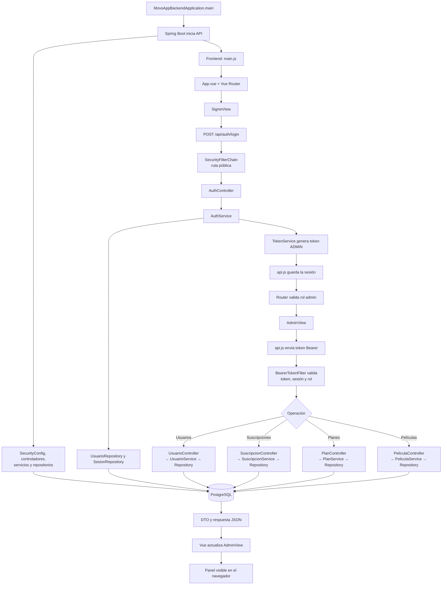
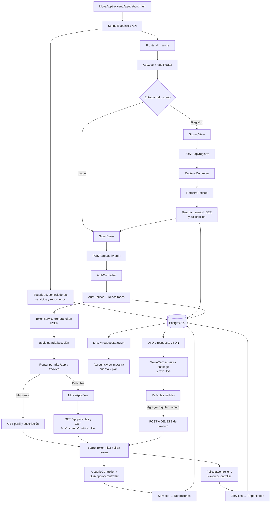

# Flujo de Movs App

## Administrador

El flujo del administrador comienza cuando Spring Boot inicia la API y conecta las capas de seguridad, controladores, servicios, repositorios y base de datos. Después de iniciar sesión mediante `AuthController`, el backend valida las credenciales, registra la sesión y genera un token con rol `ADMIN`; el frontend lo guarda y Vue Router permite abrir `AdminView`. Cada consulta o modificación posterior envía ese token, pasa por `BearerTokenFilter` y, según la operación, llega al controlador correspondiente. El controlador delega la lógica al servicio, el servicio utiliza el repositorio para trabajar con PostgreSQL y la respuesta regresa como un DTO en formato JSON, con el cual Vue actualiza el panel mostrado en el navegador.

## Usuario

El usuario puede registrarse mediante `RegistroController`, que delega en `RegistroService` la creación de la cuenta con rol `USER` y su suscripción, o iniciar sesión directamente por medio de `AuthController`. Una vez generado y almacenado el token, Vue Router permite acceder a la cuenta y al catálogo. Las solicitudes protegidas pasan por `BearerTokenFilter`; luego llegan a los controladores de usuario, suscripción, películas o favoritos, continúan por sus servicios y repositorios, y consultan PostgreSQL. Finalmente, el backend devuelve DTO en formato JSON para que `AccountsView` muestre los datos de la cuenta y `MovieAppView` renderice el catálogo, además de permitir agregar o quitar películas favoritas.

## Vocabulario técnico

| Término | Significado dentro del proyecto |
|---|---|
| API | Interfaz que permite que el frontend se comunique con el backend mediante solicitudes HTTP. |
| REST | Estilo utilizado para organizar la API alrededor de recursos y métodos HTTP. |
| Backend | Parte ejecutada en el servidor; contiene seguridad, reglas de negocio y acceso a datos. |
| Frontend | Interfaz ejecutada en el navegador y construida con Vue. |
| Spring Boot | Framework de Java que inicia y configura la aplicación backend. |
| Vue | Framework de JavaScript utilizado para construir la interfaz reactiva. |
| Vue Router | Componente que decide qué vista mostrar según la URL y aplica guardas de navegación. |
| Endpoint | Combinación de una ruta y un método HTTP que ofrece una operación de la API. |
| HTTP | Protocolo usado para intercambiar solicitudes y respuestas entre frontend y backend. |
| GET | Método HTTP utilizado principalmente para consultar información. |
| POST | Método HTTP usado para crear recursos o ejecutar acciones como iniciar sesión. |
| PUT | Método HTTP empleado para actualizar un recurso existente. |
| DELETE | Método HTTP utilizado para eliminar un recurso. |
| Controlador | Capa que recibe la petición HTTP, valida la entrada básica y llama al servicio. |
| Servicio | Capa donde se ejecutan las reglas de negocio y se coordinan los repositorios. |
| Repositorio | Capa que realiza operaciones de consulta, guardado, actualización y eliminación en la base de datos. |
| Entidad JPA | Clase Java que representa una tabla de la base de datos. |
| JPA | Especificación de Java para relacionar objetos con tablas. |
| Hibernate | Implementación de JPA utilizada para convertir operaciones con objetos en sentencias SQL. |
| PostgreSQL | Sistema gestor de base de datos relacional utilizado por la aplicación. |
| DTO | Objeto diseñado para transportar únicamente los datos que entran o salen de la API. |
| JSON | Formato de texto usado para enviar datos entre el frontend y el backend. |
| Token | Credencial temporal que identifica al usuario autenticado. |
| Bearer | Esquema del encabezado `Authorization` que transporta el token en cada petición protegida. |
| HS256 | Algoritmo HMAC con SHA-256 usado para firmar y verificar el token. |
| Autenticación | Proceso de comprobar quién es el usuario mediante correo y contraseña. |
| Autorización | Proceso de comprobar qué operaciones puede realizar el usuario según su rol. |
| Rol | Nivel de acceso asignado a una cuenta; en este sistema puede ser `ADMIN` o `USER`. |
| `SecurityFilterChain` | Configuración que define qué rutas son públicas y qué roles pueden acceder a las rutas protegidas. |
| `BearerTokenFilter` | Filtro que revisa el token y la sesión antes de permitir que una petición protegida continúe. |
| BCrypt | Algoritmo utilizado para almacenar contraseñas como hashes, sin guardar el texto original. |
| Hash | Resultado irreversible aplicado a la contraseña para evitar almacenarla en texto plano. |
| Sesión | Registro en PostgreSQL que indica si el acceso de un usuario continúa activo. |
| Stateless | Modelo en el que Spring Security no conserva una sesión HTTP en memoria entre peticiones. |
| Transacción | Conjunto de operaciones de base de datos que se confirma completo o se revierte ante un error. |
| CORS | Política que controla desde qué orígenes web se permite llamar a la API. |
| CSRF | Ataque que intenta ejecutar acciones con las credenciales de otra persona desde un sitio distinto. |
| Inyección de dependencias | Mecanismo mediante el cual Spring entrega a cada clase los servicios o repositorios que necesita. |
| Estado reactivo | Datos que, al cambiar en Vue, provocan la actualización automática de la interfaz. |
| Clave primaria compuesta | Identificador formado por más de una columna; en `favoritos` combina usuario y película. |
| Clave foránea | Columna que enlaza un registro con otro registro de una tabla relacionada. |
| DTO de respuesta | Estructura que evita devolver directamente las entidades internas de JPA. |
| Código 201 | Respuesta que indica que un recurso fue creado correctamente. |
| Código 204 | Respuesta exitosa que no contiene cuerpo. |
| Código 401 | Indica que falta autenticación o que el token no es válido. |
| Código 403 | Indica que el usuario está autenticado, pero no tiene el permiso necesario. |
| Código 409 | Indica un conflicto, como un correo duplicado o una sesión que ya está activa. |

## Preguntas de revisión técnica

1. **¿Qué hace SpringApplication.run dentro de MovsAppBackendApplication.main?**

   **Respuesta:** Crea el contexto de Spring, detecta los componentes, construye las dependencias y levanta el servidor HTTP. Si se elimina esa llamada, el método main se ejecuta, pero la API no inicia.

2. **¿Por qué MovsAppBackendApplication excluye UserDetailsServiceAutoConfiguration?**

   **Respuesta:** Porque el proyecto no usa el formulario de login ni el usuario automático de Spring Security. La autenticación se implementa con AuthService, BearerTokenFilter y la tabla de sesiones; si se quita la exclusión, Spring podría crear una configuración de usuario adicional que no pertenece a este flujo.

3. **¿Para qué sirve el método configure de SpringBootServletInitializer?**

   **Respuesta:** Permite desplegar la aplicación como un archivo WAR dentro de un servidor de aplicaciones externo. Para ejecutarla como JAR con main no es indispensable, pero conservarlo admite ambas formas de despliegue.

4. **¿Qué efecto tiene SessionCreationPolicy.STATELESS en SecurityConfig?**

   **Respuesta:** Evita que Spring Security mantenga una sesión HTTP entre solicitudes. Cada petición debe presentar nuevamente el token; cambiarlo a un modo con sesión mezclaría dos mecanismos de autenticación y obligaría a revisar logout, CSRF y almacenamiento de credenciales.

5. **¿Por qué csrf está desactivado en la cadena de seguridad?**

   **Respuesta:** La API recibe el token en el encabezado Authorization y no autentica mediante una cookie de sesión enviada automáticamente. Si el proyecto cambia a cookies de autenticación, desactivar CSRF dejaría de ser una decisión segura y debería habilitarse su protección.

6. **¿Qué controla app.cors.allowed-origins?**

   **Respuesta:** Define qué orígenes del navegador pueden llamar a las rutas /api. Si se configura con un origen incorrecto, el navegador bloqueará el frontend; si se amplía sin necesidad, se aceptarán solicitudes desde sitios no previstos.

7. **¿Por qué BearerTokenFilter se agrega antes de UsernamePasswordAuthenticationFilter?**

   **Respuesta:** Para que el token sea validado y el usuario quede autenticado antes de que Spring evalúe los permisos de la ruta. Si se coloca después de la autorización, una petición válida podría ser rechazada por no tener todavía un principal autenticado.

8. **¿Por qué bearerTokenFilterRegistration desactiva el registro automático del filtro?**

   **Respuesta:** Spring podría registrar el filtro como filtro servlet por ser un componente y, además, SecurityConfig lo agrega a la cadena de seguridad. Desactivar el registro automático evita que se ejecute dos veces en una misma solicitud.

9. **¿Qué pasa en BearerTokenFilter cuando no existe el encabezado Authorization?**

   **Respuesta:** El filtro deja continuar la solicitud sin crear una autenticación. Luego SecurityConfig permite la ruta si es pública o responde 401 si la ruta exige un usuario autenticado.

10. **¿Qué ocurre si Authorization no comienza con Bearer o no contiene token?**

    **Respuesta:** El filtro lanza una excepción de autenticación, limpia el contexto y usa AuthenticationEntryPoint para devolver un 401 uniforme. La solicitud no alcanza el controlador.

11. **¿Por qué el filtro consulta SesionRepository después de verificar la firma del token?**

    **Respuesta:** La firma demuestra que el token no fue alterado, pero la consulta confirma que su sesión continúa activa y pertenece al mismo usuario. Esto permite invalidar el token mediante logout, aunque añade una consulta a PostgreSQL en cada petición autenticada.

12. **¿Qué hace el prefijo ROLE_ al crear SimpleGrantedAuthority?**

    **Respuesta:** Adapta ADMIN o USER al formato que Spring espera cuando se usa hasRole. Si se elimina el prefijo y se mantienen las reglas hasRole, los permisos no coincidirán y las solicitudes autorizadas recibirán 403.

13. **¿Cómo protege TokenService un token contra modificaciones?**

    **Respuesta:** Firma encabezado y contenido con HMAC-SHA256 y un secreto privado. Al recibirlo vuelve a calcular la firma y usa una comparación segura; cualquier cambio en los datos produce un token inválido.

14. **¿Qué pasa con los tokens existentes si cambia APP_SECURITY_JWT_SECRET?**

    **Respuesta:** Todos dejan de validar porque fueron firmados con el secreto anterior. Es útil para una revocación general, pero también cerrará las sesiones de todos los usuarios.

15. **¿Qué cambia al modificar APP_SECURITY_JWT_TTL_MINUTES?**

    **Respuesta:** Cambia la duración de los tokens emitidos después de reiniciar la aplicación. Un valor alto aumenta el tiempo útil de un token robado; uno demasiado bajo obliga al usuario a iniciar sesión con mucha frecuencia.

16. **¿El token generado es un JWT completamente estándar?**

    **Respuesta:** Tiene tres partes y una firma HS256, pero el contenido usa pares como uid, email y role en vez de un objeto JSON convencional. Funciona con TokenService, aunque puede no ser compatible con bibliotecas o servicios externos que esperen claims JWT estándar.

17. **¿Qué sucede al activar APP_SECURITY_REQUIRE_HTTPS?**

    **Respuesta:** BearerTokenFilter rechazará tokens recibidos en solicitudes que el servidor considere no seguras. Detrás de un proxy HTTPS debe configurarse correctamente el manejo de encabezados reenviados; de lo contrario, el backend podría interpretar la petición como HTTP y rechazarla.

18. **¿Por qué BCryptPasswordEncoder se configura con costo 12?**

    **Respuesta:** El costo hace que calcular cada hash sea deliberadamente caro y dificulta ataques de fuerza bruta sobre contraseñas filtradas. Aumentarlo mejora la resistencia, pero también consume más CPU durante registro y login, por lo que debe medirse.

19. **¿Qué limitación tiene ConcurrentHashMap en LoginRateLimitService?**

    **Respuesta:** Los intentos se almacenan únicamente en la memoria del proceso. Se pierden al reiniciar y no se comparten si existen varias instancias; para escalar sería necesario un almacenamiento común como Redis.

20. **¿Por qué la clave del límite de login combina IP y correo?**

    **Respuesta:** Permite contar intentos dirigidos a una cuenta desde una dirección concreta. Cambiarla solo por correo facilitaría bloquear a otra persona intencionalmente, mientras que usar solo IP podría afectar a muchos usuarios detrás de la misma red.

21. **¿Para qué sirve findForUpdateByUsuarioId durante el login?**

    **Respuesta:** Bloquea la fila de sesión dentro de la transacción mientras se decide si puede reactivarse. Sin ese bloqueo, dos solicitudes simultáneas podrían observar la sesión inactiva e intentar abrirla al mismo tiempo.

22. **¿Qué pasa si un usuario intenta iniciar sesión mientras su sesión sigue activa?**

    **Respuesta:** AuthService lanza ConflictoException y la API responde 409. El diseño admite una sola sesión activa por usuario, apoyado también por la restricción única de sesiones.usuario_id.

23. **¿Cómo invalida el backend un token durante el logout?**

    **Respuesta:** AuthService marca la sesión como inactiva y registra la fecha de cierre. El token conserva una firma válida, pero BearerTokenFilter lo rechaza en la siguiente petición porque la sesión ya no está activa.

24. **¿Qué hace getSession en api.js cuando tokenExpira ya pasó?**

    **Respuesta:** Elimina movsSession de sessionStorage y localStorage y devuelve null. La guarda del router redirige al login, aunque la validación definitiva sigue estando en el backend.

25. **¿Qué diferencia produce marcar “recordar” en el login?**

    **Respuesta:** La sesión se guarda en localStorage y permanece al cerrar el navegador; sin esa opción se usa sessionStorage y dura solo durante la pestaña o sesión del navegador. Persistirla más tiempo también amplía la exposición ante XSS.

26. **¿Qué hace request de api.js antes de ejecutar fetch?**

    **Respuesta:** Construye los encabezados, agrega Content-Type cuando existe cuerpo, adjunta el Bearer token y crea un AbortController. Centralizar esta lógica evita repetir el manejo de autenticación y errores en cada vista.

27. **¿Qué ocurre si una petición tarda más de 5000 milisegundos?**

    **Respuesta:** AbortController cancela fetch y api.js genera el mensaje de que el servidor no respondió a tiempo. Aumentar el límite toleraría operaciones lentas, pero también mantendría la interfaz esperando durante más tiempo.

28. **¿Puede un usuario convertirse en administrador modificando localStorage?**

    **Respuesta:** Puede engañar a Vue Router y mostrar la ruta /admin, porque esa guarda lee el rol local. No obtiene permisos reales: SecurityConfig vuelve a comprobar el rol firmado del token y responde 403 en las operaciones administrativas.

29. **¿Por qué /api/usuarios/me debe declararse antes de /api/usuarios/** en SecurityConfig?**

    **Respuesta:** Las reglas se evalúan en orden y la primera coincidencia se aplica. La ruta personal debe aceptar USER y ADMIN antes de la regla general que reserva el resto de usuarios para ADMIN.

30. **¿Por qué los favoritos pueden fallar con 403 para un usuario USER en la configuración actual?**

    **Respuesta:** /api/usuarios/me/favoritos no coincide con la regla exacta de /api/usuarios/me y después entra en /api/usuarios/**, que exige ADMIN. Debe agregarse una regla específica para /api/usuarios/me/favoritos/** antes del comodín administrativo.

31. **¿La anotación RequireRole se ejecuta automáticamente?**

    **Respuesta:** No. El proyecto define la anotación, pero no contiene un aspecto, interceptor o autorización por método que la procese. Quitarla no cambiaría hoy el resultado; la seguridad efectiva está en SecurityConfig y en algunas comprobaciones de SecurityContext.

32. **¿Qué protege SecurityContext.requireSelfOrAdmin en SuscripcionController?**

    **Respuesta:** Compara el usuario del token con el identificador solicitado y permite una excepción para ADMIN. Si se elimina, un USER autenticado podría intentar consultar o crear datos para otro usuario cuando la ruta general lo permita.

33. **¿Por qué RegistroService.registrar tiene Transactional?**

    **Respuesta:** Porque guarda usuario y suscripción como una sola unidad. Si falla el plan, el rol o la suscripción, la transacción revierte los cambios y evita una cuenta creada parcialmente.

34. **¿Por qué el alta de usuario desde AdminView puede quedar incompleta?**

    **Respuesta:** El frontend llama primero a createUser y después a createSubscription en dos peticiones independientes. Si la segunda falla, la primera ya fue confirmada; la solución sería un endpoint backend transaccional que realice ambas operaciones.

35. **¿Qué problema existe entre Pelicula.java y db/01_schema.sql?**

    **Respuesta:** La tabla peliculas exige categoria_id NOT NULL, pero la entidad y PeliculaRequest no incluyen la categoría. Un INSERT desde PeliculaService puede violar esa restricción; se debe mapear Categoria o cambiar de forma coherente el esquema.

36. **¿Por qué FavoritoId contiene usuarioId y peliculaId?**

    **Respuesta:** Es la clave primaria compuesta que identifica de forma única la relación entre un usuario y una película. Gracias a ella, una misma película no puede agregarse dos veces a los favoritos del mismo usuario.

37. **¿Qué efecto tienen los ON DELETE CASCADE de la tabla favoritos?**

    **Respuesta:** Al eliminar un usuario o una película, PostgreSQL elimina automáticamente sus relaciones de favoritos. Si se retira el cascade, la eliminación puede fallar por claves foráneas o exigir una limpieza manual previa.

38. **¿Por qué Favorito usa FetchType.LAZY en sus relaciones?**

    **Respuesta:** Evita cargar usuario y película automáticamente cuando no se necesitan. FavoritoService convierte la película a DTO dentro de una transacción; si se intentara acceder a la relación fuera de ella, podría aparecer un error de carga diferida.

39. **¿Qué se evita al devolver PeliculaResponse en lugar de la entidad Pelicula?**

    **Respuesta:** Se evita exponer detalles internos de persistencia y futuras relaciones JPA. Si la entidad cambia, el contrato de la API puede mantenerse estable modificando solamente el mapeo al DTO.

40. **¿Qué pasa si se cambia una entidad Java pero no el script SQL?**

   **Respuesta:** Hibernate no actualizará la base porque ddl-auto está configurado en none. La aplicación puede fallar por columnas o restricciones incompatibles; todo cambio del modelo debe acompañarse de una migración SQL y pruebas.
