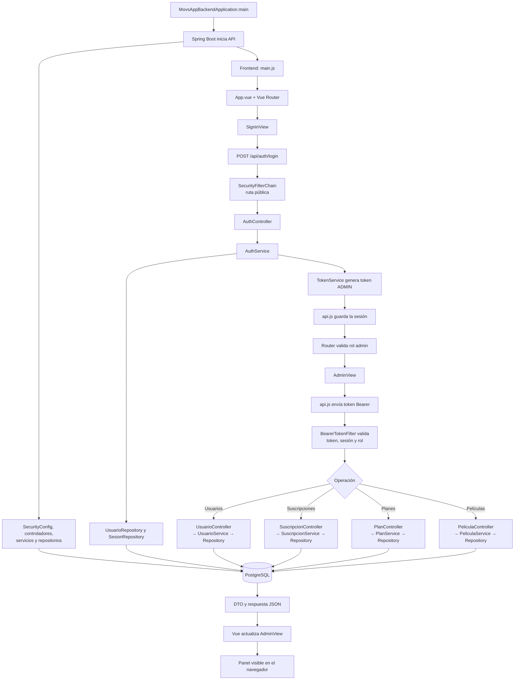
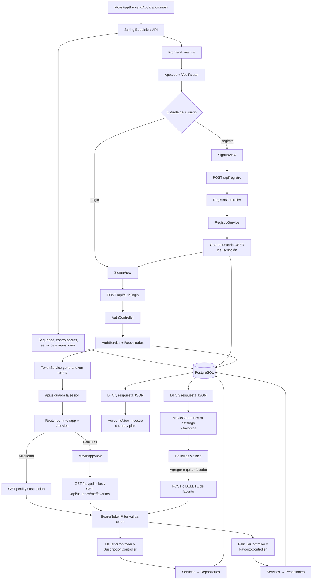

# Flujo de Movs App

## Administrador

```mermaid
flowchart TD
    A[MovsAppBackendApplication.main] --> B[Spring Boot inicia API]
    B --> C[SecurityConfig, controladores,<br/>servicios y repositorios]
    C --> D[(PostgreSQL)]
    B --> E[Frontend: main.js]
    E --> F[App.vue + Vue Router]
    F --> G[SigninView]

    G --> H[POST /api/auth/login]
    H --> I[SecurityFilterChain<br/>ruta pública]
    I --> J[AuthController]
    J --> K[AuthService]
    K --> L[UsuarioRepository y SesionRepository]
    L --> D
    K --> M[TokenService genera token ADMIN]
    M --> N[api.js guarda la sesión]
    N --> O[Router valida rol admin]
    O --> P[AdminView]

    P --> Q[api.js envía token Bearer]
    Q --> R[BearerTokenFilter valida<br/>token, sesión y rol]
    R --> S{Operación}
    S -->|Usuarios| T[UsuarioController<br/>→ UsuarioService → Repository]
    S -->|Suscripciones| U[SuscripcionController<br/>→ SuscripcionService → Repository]
    S -->|Planes| V[PlanController<br/>→ PlanService → Repository]
    S -->|Películas| W[PeliculaController<br/>→ PeliculaService → Repository]
    T --> D
    U --> D
    V --> D
    W --> D
    D --> X[DTO y respuesta JSON]
    X --> Y[Vue actualiza AdminView]
    Y --> Z[Panel visible en el navegador]
```

## Usuario

```mermaid
flowchart TD
    A[MovsAppBackendApplication.main] --> B[Spring Boot inicia API]
    B --> C[Seguridad, controladores,<br/>servicios y repositorios]
    C --> D[(PostgreSQL)]
    B --> E[Frontend: main.js]
    E --> F[App.vue + Vue Router]
    F --> G{Entrada del usuario}

    G -->|Registro| H[SignupView]
    H --> I[POST /api/registro]
    I --> J[RegistroController]
    J --> K[RegistroService]
    K --> L[Guarda usuario USER<br/>y suscripción]
    L --> D

    G -->|Login| M[SigninView]
    L --> M
    M --> N[POST /api/auth/login]
    N --> O[AuthController]
    O --> P[AuthService + Repositories]
    P --> D
    P --> Q[TokenService genera token USER]
    Q --> R[api.js guarda la sesión]
    R --> S[Router permite /app y /movies]

    S -->|Mi cuenta| T[GET perfil y suscripción]
    T --> U[BearerTokenFilter valida token]
    U --> V[UsuarioController y<br/>SuscripcionController]
    V --> W[Services → Repositories]
    W --> D
    D --> X[DTO y respuesta JSON]
    X --> Y[AccountsView muestra<br/>cuenta y plan]

    S -->|Películas| Z[MovieAppView]
    Z --> AA[GET /api/peliculas y<br/>GET /api/usuarios/me/favoritos]
    AA --> U
    U --> AB[PeliculaController y<br/>FavoritoController]
    AB --> AC[Services → Repositories]
    AC --> D
    D --> AD[DTO y respuesta JSON]
    AD --> AE[MovieCard muestra catálogo<br/>y favoritos]
    AE --> AF[Películas visibles]
    AF -->|Agregar o quitar favorito| AG[POST o DELETE de favorito]
    AG --> U
```
