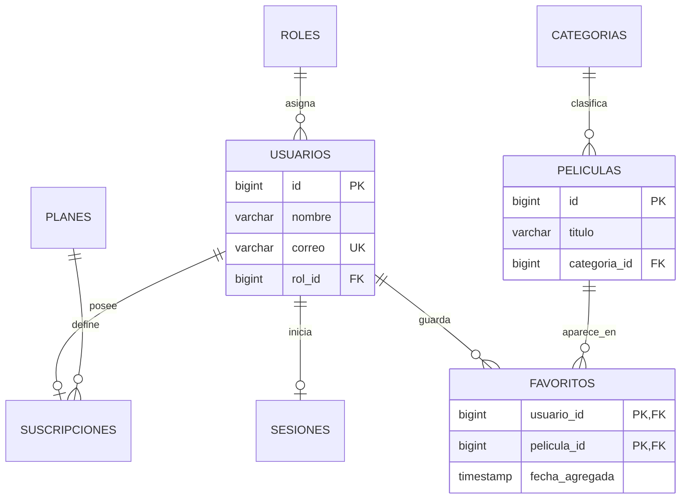

# Propuesta para relacionar películas con usuarios

## 1. Contexto

En el diagrama entidad-relación actual del `README.md`, la tabla `peliculas` solo se relaciona con `categorias`. Por otro lado, `usuarios` ya forma parte del conjunto principal de relaciones del sistema:

- cada usuario tiene un rol;
- puede tener una suscripción;
- puede iniciar una sesión;
- su suscripción pertenece a un plan.

Se propone conectar `peliculas` con `usuarios` mediante una tabla intermedia llamada `favoritos`. Esta relación permitiría que cada usuario guarde películas en una lista personal, una función consistente con el beneficio «Full HD y favoritos» que ya aparece en los datos del plan Plus.

## 2. Relación propuesta

La relación entre `usuarios` y `peliculas` es de muchos a muchos:

- un usuario puede guardar cero o muchas películas;
- una película puede ser guardada por cero o muchos usuarios;
- cada fila de `favoritos` pertenece exactamente a un usuario y a una película.

La tabla intermedia evita agregar listas o datos repetidos dentro de `usuarios` o `peliculas` y mantiene el modelo normalizado.



`categorias` se conserva sin cambios: la nueva relación no la utiliza como tabla intermedia ni modifica su vínculo actual con `peliculas`.

## 3. Definición SQL sugerida

```sql
CREATE TABLE IF NOT EXISTS favoritos (
  usuario_id BIGINT NOT NULL,
  pelicula_id BIGINT NOT NULL,
  fecha_agregada TIMESTAMP(6) NOT NULL DEFAULT CURRENT_TIMESTAMP,
  CONSTRAINT pk_favoritos PRIMARY KEY (usuario_id, pelicula_id),
  CONSTRAINT fk_favoritos_usuarios
    FOREIGN KEY (usuario_id) REFERENCES usuarios(id) ON DELETE CASCADE,
  CONSTRAINT fk_favoritos_peliculas
    FOREIGN KEY (pelicula_id) REFERENCES peliculas(id) ON DELETE CASCADE
);

CREATE INDEX IF NOT EXISTS idx_favoritos_pelicula
  ON favoritos (pelicula_id);
```

La clave primaria compuesta impide que un usuario agregue dos veces la misma película. `ON DELETE CASCADE` elimina automáticamente los favoritos asociados cuando se elimina el usuario o la película. El índice por `pelicula_id` mejora consultas como contar cuántos usuarios marcaron una película; la clave primaria ya sirve para buscar los favoritos de un usuario.

## 4. Comportamiento esperado

El backend podría incorporar estas operaciones:

| Método | Ruta | Acceso | Función |
|---|---|---|---|
| `GET` | `/api/usuarios/me/favoritos` | USER / ADMIN | Listar las películas favoritas del usuario autenticado |
| `POST` | `/api/usuarios/me/favoritos/{peliculaId}` | USER / ADMIN | Agregar una película a favoritos |
| `DELETE` | `/api/usuarios/me/favoritos/{peliculaId}` | USER / ADMIN | Quitar una película de favoritos |

El usuario debe obtenerse del JWT y no desde un identificador enviado por el cliente. Antes de insertar un favorito, el servicio debe comprobar que la película existe. Si la función está reservada al plan Plus, el servicio también debe verificar que la suscripción esté activa y corresponda a dicho plan; esa regla no debería incorporarse como una clave foránea adicional en `favoritos` porque el propietario del favorito sigue siendo el usuario.

## 5. Cambios necesarios en la aplicación

1. Agregar la tabla `favoritos` al script `db/01_schema.sql`.
2. Crear en el backend la entidad o clave compuesta, el repositorio, el servicio y el controlador correspondientes.
3. Devolver las películas favoritas usando los DTO existentes, evitando exponer entidades JPA directamente.
4. Añadir en el frontend el botón para agregar o quitar favoritos y una vista de lista personal.
5. Actualizar el diagrama ER y la tabla de APIs del `README.md`.
6. Probar duplicados, películas inexistentes, usuarios sin autorización y eliminación en cascada.

## 6. Conclusión

La tabla `favoritos` es una conexión pequeña y útil entre `peliculas` y `usuarios`, una tabla que ya está relacionada con el resto del dominio. El diseño representa correctamente una relación de muchos a muchos, evita duplicados y permite ampliar el catálogo con una funcionalidad personal sin depender de `categorias`.
