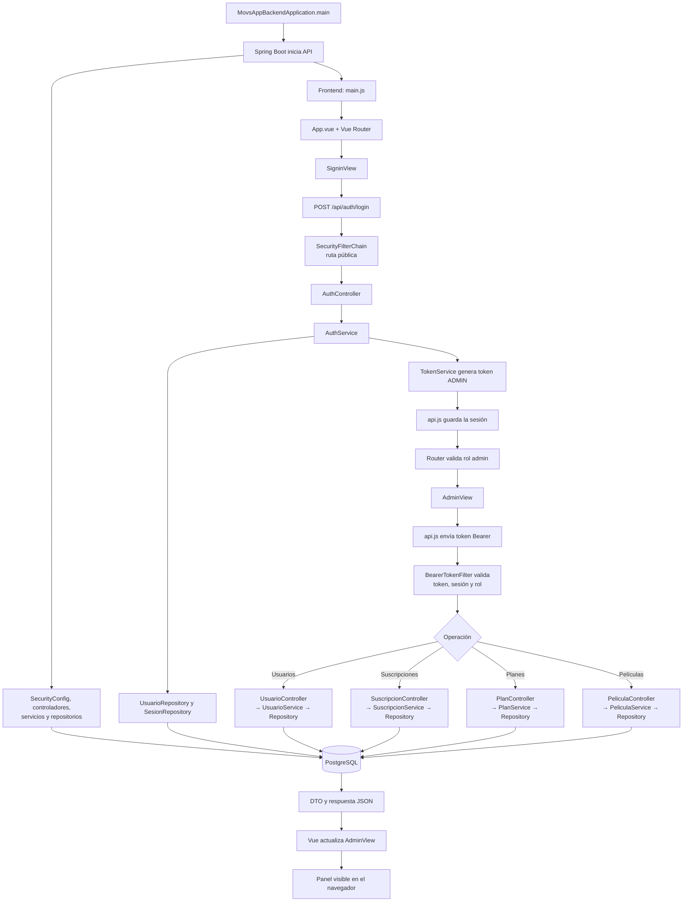
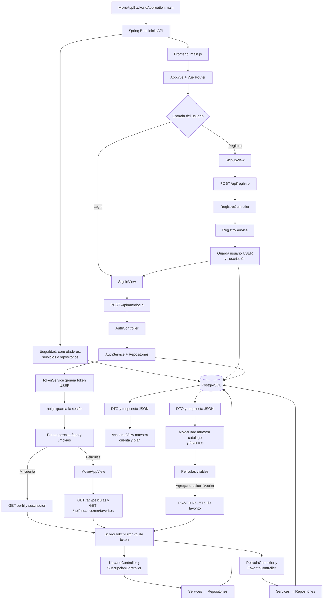

# Flujo de Movs App

## Administrador

El flujo del administrador comienza cuando Spring Boot inicia la API y conecta las capas de seguridad, controladores, servicios, repositorios y base de datos. Después de iniciar sesión mediante `AuthController`, el backend valida las credenciales, registra la sesión y genera un token con rol `ADMIN`; el frontend lo guarda y Vue Router permite abrir `AdminView`. Cada consulta o modificación posterior envía ese token, pasa por `BearerTokenFilter` y, según la operación, llega al controlador correspondiente. El controlador delega la lógica al servicio, el servicio utiliza el repositorio para trabajar con PostgreSQL y la respuesta regresa como un DTO en formato JSON, con el cual Vue actualiza el panel mostrado en el navegador.

## Usuario

El usuario puede registrarse mediante `RegistroController`, que delega en `RegistroService` la creación de la cuenta con rol `USER` y su suscripción, o iniciar sesión directamente por medio de `AuthController`. Una vez generado y almacenado el token, Vue Router permite acceder a la cuenta y al catálogo. Las solicitudes protegidas pasan por `BearerTokenFilter`; luego llegan a los controladores de usuario, suscripción, películas o favoritos, continúan por sus servicios y repositorios, y consultan PostgreSQL. Finalmente, el backend devuelve DTO en formato JSON para que `AccountsView` muestre los datos de la cuenta y `MovieAppView` renderice el catálogo, además de permitir agregar o quitar películas favoritas.

## Vocabulario técnico

| Término | Significado dentro del proyecto |
|---|---|
| API | Interfaz que permite que el frontend se comunique con el backend mediante solicitudes HTTP. |
| REST | Estilo utilizado para organizar la API alrededor de recursos y métodos HTTP. |
| Backend | Parte ejecutada en el servidor; contiene seguridad, reglas de negocio y acceso a datos. |
| Frontend | Interfaz ejecutada en el navegador y construida con Vue. |
| Spring Boot | Framework de Java que inicia y configura la aplicación backend. |
| Vue | Framework de JavaScript utilizado para construir la interfaz reactiva. |
| Vue Router | Componente que decide qué vista mostrar según la URL y aplica guardas de navegación. |
| Endpoint | Combinación de una ruta y un método HTTP que ofrece una operación de la API. |
| HTTP | Protocolo usado para intercambiar solicitudes y respuestas entre frontend y backend. |
| GET | Método HTTP utilizado principalmente para consultar información. |
| POST | Método HTTP usado para crear recursos o ejecutar acciones como iniciar sesión. |
| PUT | Método HTTP empleado para actualizar un recurso existente. |
| DELETE | Método HTTP utilizado para eliminar un recurso. |
| Controlador | Capa que recibe la petición HTTP, valida la entrada básica y llama al servicio. |
| Servicio | Capa donde se ejecutan las reglas de negocio y se coordinan los repositorios. |
| Repositorio | Capa que realiza operaciones de consulta, guardado, actualización y eliminación en la base de datos. |
| Entidad JPA | Clase Java que representa una tabla de la base de datos. |
| JPA | Especificación de Java para relacionar objetos con tablas. |
| Hibernate | Implementación de JPA utilizada para convertir operaciones con objetos en sentencias SQL. |
| PostgreSQL | Sistema gestor de base de datos relacional utilizado por la aplicación. |
| DTO | Objeto diseñado para transportar únicamente los datos que entran o salen de la API. |
| JSON | Formato de texto usado para enviar datos entre el frontend y el backend. |
| Token | Credencial temporal que identifica al usuario autenticado. |
| Bearer | Esquema del encabezado `Authorization` que transporta el token en cada petición protegida. |
| HS256 | Algoritmo HMAC con SHA-256 usado para firmar y verificar el token. |
| Autenticación | Proceso de comprobar quién es el usuario mediante correo y contraseña. |
| Autorización | Proceso de comprobar qué operaciones puede realizar el usuario según su rol. |
| Rol | Nivel de acceso asignado a una cuenta; en este sistema puede ser `ADMIN` o `USER`. |
| `SecurityFilterChain` | Configuración que define qué rutas son públicas y qué roles pueden acceder a las rutas protegidas. |
| `BearerTokenFilter` | Filtro que revisa el token y la sesión antes de permitir que una petición protegida continúe. |
| BCrypt | Algoritmo utilizado para almacenar contraseñas como hashes, sin guardar el texto original. |
| Hash | Resultado irreversible aplicado a la contraseña para evitar almacenarla en texto plano. |
| Sesión | Registro en PostgreSQL que indica si el acceso de un usuario continúa activo. |
| Stateless | Modelo en el que Spring Security no conserva una sesión HTTP en memoria entre peticiones. |
| Transacción | Conjunto de operaciones de base de datos que se confirma completo o se revierte ante un error. |
| CORS | Política que controla desde qué orígenes web se permite llamar a la API. |
| CSRF | Ataque que intenta ejecutar acciones con las credenciales de otra persona desde un sitio distinto. |
| Inyección de dependencias | Mecanismo mediante el cual Spring entrega a cada clase los servicios o repositorios que necesita. |
| Estado reactivo | Datos que, al cambiar en Vue, provocan la actualización automática de la interfaz. |
| Clave primaria compuesta | Identificador formado por más de una columna; en `favoritos` combina usuario y película. |
| Clave foránea | Columna que enlaza un registro con otro registro de una tabla relacionada. |
| DTO de respuesta | Estructura que evita devolver directamente las entidades internas de JPA. |
| Código 201 | Respuesta que indica que un recurso fue creado correctamente. |
| Código 204 | Respuesta exitosa que no contiene cuerpo. |
| Código 401 | Indica que falta autenticación o que el token no es válido. |
| Código 403 | Indica que el usuario está autenticado, pero no tiene el permiso necesario. |
| Código 409 | Indica un conflicto, como un correo duplicado o una sesión que ya está activa. |

## Preguntas de revisión técnica

1. **¿Qué arquitectura utiliza la aplicación?**
   **Respuesta:** Utiliza una arquitectura por capas: vista frontend, cliente de API, seguridad, controlador, servicio, repositorio y base de datos.

2. **¿El frontend accede directamente a PostgreSQL?**
   **Respuesta:** No. El frontend llama a la API REST; únicamente los repositorios del backend acceden a PostgreSQL.

3. **¿Para qué sirve un controlador?**
   **Respuesta:** Expone rutas HTTP, recibe y valida solicitudes, llama a la capa de servicio y devuelve una respuesta.

4. **¿Por qué la lógica de negocio no debería estar en el controlador?**
   **Respuesta:** Porque mezclar HTTP con reglas de negocio dificulta las pruebas, la reutilización y el mantenimiento.

5. **¿Cuál es la función del servicio?**
   **Respuesta:** Ejecutar reglas de negocio, controlar transacciones y coordinar uno o varios repositorios.

6. **¿Cuál es la función del repositorio?**
   **Respuesta:** Abstraer las operaciones de persistencia realizadas sobre las entidades de la base de datos.

7. **¿Cuál es la diferencia entre autenticación y autorización?**
   **Respuesta:** La autenticación identifica al usuario; la autorización determina si ese usuario puede ejecutar una operación.

8. **¿Dónde se aplican realmente los permisos por rol?**
   **Respuesta:** Principalmente en `SecurityConfig`, mediante reglas por método y ruta. La guarda de Vue mejora la navegación, pero no reemplaza la seguridad del backend.

9. **¿La anotación `@RequireRole` protege por sí sola los métodos?**
   **Respuesta:** No se observa un aspecto o interceptor que procese esa anotación. Actualmente funciona como declaración de intención; la protección efectiva depende de `SecurityConfig` y de `SecurityContext`.

10. **¿Qué hace `BearerTokenFilter` antes de llegar al controlador?**
    **Respuesta:** Verifica el formato, firma y vencimiento del token, consulta que la sesión siga activa y crea el principal autenticado con su rol.

11. **¿Por qué se consulta la sesión si ya existe un token?**
    **Respuesta:** Porque permite invalidar el acceso al cerrar sesión. Un token firmado todavía puede no haber vencido, pero se rechaza si su sesión fue desactivada.

12. **¿Qué ocurre cuando vence el token?**
    **Respuesta:** El frontend elimina la sesión local al detectar la expiración y el backend también rechaza el token si recibe una petición con él.

13. **¿Dónde se guarda el token en el navegador?**
    **Respuesta:** En `sessionStorage` o `localStorage`, según la opción de recordar la sesión.

14. **¿Qué riesgo tiene guardar el token en `localStorage`?**
    **Respuesta:** Un ataque XSS podría leerlo. Se deben evitar scripts no confiables, aplicar una política CSP y evaluar cookies `HttpOnly` para un entorno de producción.

15. **¿La comunicación exige HTTPS actualmente?**
    **Respuesta:** No por defecto, porque `APP_SECURITY_REQUIRE_HTTPS` parte en `false`. En producción debe habilitarse HTTPS para no exponer credenciales ni tokens.

16. **¿Es seguro usar el secreto JWT configurado por defecto?**
    **Respuesta:** No. `dev-only-change-this-secret` es solo un valor de desarrollo; producción necesita un secreto fuerte, privado y proporcionado mediante variables de entorno.

17. **¿Las contraseñas se almacenan en texto plano?**
    **Respuesta:** No. Se procesan con BCrypt y un costo de 12 antes de guardarse.

18. **¿Cómo se limita la fuerza bruta contra el login?**
    **Respuesta:** `LoginRateLimitService` limita intentos por combinación de IP y correo. Sin embargo, el contador está en memoria y no se comparte entre varias instancias del backend.

19. **¿Puede un usuario abrir dos sesiones al mismo tiempo?**
    **Respuesta:** El diseño lo impide: existe una sesión única por usuario y `AuthService` rechaza un nuevo login si la anterior continúa activa.

20. **¿El registro de usuario y suscripción es atómico?**
    **Respuesta:** Sí. `RegistroService.registrar` es transaccional; si falla la suscripción, también se revierte la creación del usuario.

21. **¿La creación de usuario y suscripción desde el panel admin también es atómica?**
    **Respuesta:** No completamente. El frontend ejecuta dos solicitudes distintas; si se crea el usuario y luego falla la suscripción, puede quedar un usuario sin plan.

22. **¿El catálogo de películas está protegido en el backend?**
    **Respuesta:** Los `GET /api/peliculas/**` son públicos en `SecurityConfig`, aunque la ruta `/movies` esté protegida en Vue. Por tanto, el catálogo puede consultarse directamente sin iniciar sesión.

23. **¿Los favoritos sí requieren autenticación?**
    **Respuesta:** Sí. Sus rutas no están declaradas como públicas y terminan en la regla que exige autenticación para `/api/**`.

24. **¿Cómo evita el sistema que un usuario modifique favoritos ajenos?**
    **Respuesta:** `FavoritoController` obtiene el identificador desde el usuario autenticado del token; no acepta un identificador de usuario enviado por el cliente.

25. **¿Cómo se impiden favoritos duplicados?**
    **Respuesta:** La clave primaria compuesta por usuario y película impide duplicados en la base de datos, y el servicio también los comprueba para devolver un error comprensible.

26. **¿Qué pasa si se intenta agregar una película inexistente?**
    **Respuesta:** `FavoritoService` busca la película y devuelve un error 404 si no existe.

27. **¿Todos los planes pueden usar favoritos?**
    **Respuesta:** Actualmente sí. No existe una validación en `FavoritoService` que restrinja esta función según el plan o el estado de la suscripción.

28. **¿El formulario de tarjeta realiza un pago real?**
    **Respuesta:** No. Los datos se validan visualmente en el frontend, pero no se envían al backend ni se integran con una pasarela de pago.

29. **¿Por qué se utilizan DTO en vez de devolver entidades JPA?**
    **Respuesta:** Para controlar los datos expuestos, evitar filtrar campos sensibles y desacoplar el contrato de la API del modelo interno.

30. **¿Cómo se gestionan los errores del backend?**
    **Respuesta:** `GlobalExceptionHandler` convierte excepciones conocidas en respuestas JSON uniformes con código, mensaje, ruta y validaciones.

31. **¿Qué diferencia existe entre los errores 401 y 403?**
    **Respuesta:** El 401 significa que la autenticación falta o es inválida; el 403 significa que la identidad es válida, pero su rol no tiene permiso.

32. **¿Para qué sirve CORS en este proyecto?**
    **Respuesta:** Permite que el frontend de un origen autorizado, por defecto `http://localhost:5173`, realice solicitudes a la API de otro origen.

33. **¿Por qué CSRF está desactivado?**
    **Respuesta:** La API usa tokens Bearer y no una sesión HTTP basada en cookies. La decisión es coherente con ese modelo, aunque no elimina riesgos como XSS.

34. **¿Qué sucede si el backend tarda más de cinco segundos?**
    **Respuesta:** `api.js` cancela la solicitud con `AbortController` y muestra un mensaje indicando que el servidor no respondió a tiempo.

35. **¿Dónde se validan los datos de entrada?**
    **Respuesta:** El frontend hace validaciones para mejorar la experiencia y el backend valida los DTO con Jakarta Validation; la validación confiable siempre debe permanecer en el backend.

36. **¿Hibernate crea o actualiza automáticamente las tablas?**
    **Respuesta:** No. `spring.jpa.hibernate.ddl-auto=none` obliga a gestionar el esquema mediante los scripts SQL del proyecto.

37. **¿Existe alguna inconsistencia importante entre la entidad película y el esquema SQL?**
    **Respuesta:** Sí. La tabla exige `categoria_id`, pero la entidad `Pelicula` y `PeliculaRequest` no lo modelan. La creación de una película desde el panel puede fallar por la restricción `NOT NULL`; ambas capas deben alinearse.

38. **¿Qué ocurre si la base de datos deja de estar disponible?**
    **Respuesta:** El repositorio falla, el manejador global devuelve un error del servidor y el frontend muestra el mensaje correspondiente; no existe un modo sin conexión.

39. **¿Qué pruebas deberían considerarse indispensables?**
    **Respuesta:** Login válido e inválido, roles, token vencido, sesión cerrada, registro transaccional, CRUD, acceso a datos ajenos, favoritos duplicados y errores de integridad.

40. **¿Cuáles son las mejoras prioritarias antes de producción?**
    **Respuesta:** Corregir la relación de categorías, procesar realmente `@RequireRole` o retirarla, exigir HTTPS, reemplazar secretos de desarrollo, decidir si el catálogo será público, distribuir el rate limit y hacer atómico el alta administrativa con suscripción.
